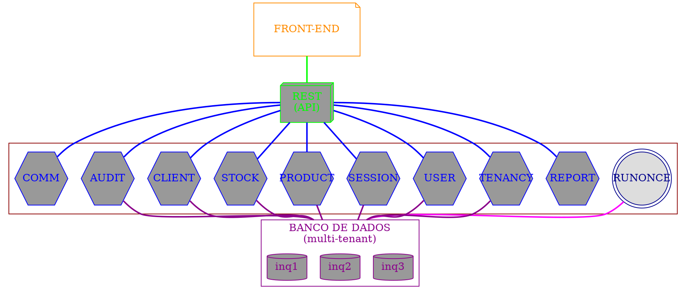
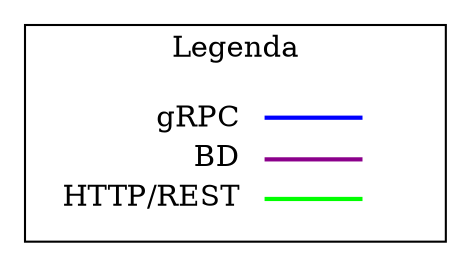

# Back-End

O back-end Minerva compõe-se de microsserviços, com uma interface comum de
comunicação externa que seja simples de usar para os padrões atuais.

O back-end compõe-se dos seguintes componentes:

1. **Componente de API:** um serviço composto de rotas HTTP, sendo
   portanto uma API REST. Este serviço requisita dados sob demanda a cada
   serviço, dependendo do recurso que foi requisitado por via externa. É
   efetivamente o intermediário entre Minerva e o mundo externo. As
   requisições entre este serviço e os outros deverão ser feito através da
   abertura de uma requisição gRPC em que este módulo seja o cliente
   requisitante; as respostas recebidas via gRPC são então retornadas
   como resposta às requisições recebidas via REST, após tratamento para
   serialização como JSON.
2. **Componente de usuários:** Servidor gRPC responsável por realizar o CRUD
   de usuários e por verificar as regras de negócio destas operações.
3. **Componente de sessão:** Servidor gRPC responsável por realizar login,
   logoff, verificação de senha e gerenciamento de sessão de usuários.
4. **Componente de produtos:** Servidor gRPC responsável por realizar o CRUD
   de produtos e por verificar as regras de negócio destas operações.
5. **Componente de estoque:** Servidor gRPC responsável por realizar regras
   de negócios relacionadas a estoque de produtos (início, baixa, lançamento,
   etc).
6. **Componente de inquilinos:** Servidor gRPC responsável por coordenar a
   criação ou remoção de novos inquilinos no sistema. Cada inquilino
   possuirá seu próprio conjunto de dados, e isso afetará diretamente na
   infraestrutura reservada para o mesmo (criação ou remoção de bancos
   de dados ou segmentos específicos em certos serviços).
7. **Componente de relatórios:** Servidor gRPC responsável pela geração de
   relatórios humanamente legíveis, envolvendo portanto agregação de dados
   de acordo com o que for externamente requisitado.
8. **Componente de clientes:** Servidor gRPC responsável por realizar o CRUD
   e a coordenação de dados de clientes do inquilino em questão.
9. **Componente de auditoria:** Servidor gRPC responsável por gerenciar a
   consulta ao logs de auditoria do sistema.
10. **Componente de comunicação instantânea:** Servidor gRPC para CRM através
	de comunicação via canais de mensagens instantâneas.

Os **serviços gRPC** supracitados tratam-se de servidores gRPC que podem
receber conexões vindas do ponto de entrada REST ou mesmo entre si. Além
disso, os serviços gRPC devem ser capazes de se comunicar com bancos de
dados, que são recursos essenciais para os mesmos (exemplo: PostgreSQL,
MongoDB, Redis). **Estes serviços devem gravar log de suas operações**,
mais especificamente nas operações de inserção, atualização e exclusão.

A API REST sempre se comunica diretamente com os serviços gRPC, e os mesmos
são encorajados a se comunicarem entre si quando for necessário estabelecer
comunicação bloqueante entre os mesmos. Todavia, quando for necessário
estabelecer comunicação não-bloqueante entre os microsserviços (leia-se,
quando o retorno para os usuários for desnecessário), será feito o uso
de mensageria com despacho automático, sem comunicação gRPC direta.

## Bibliotecas

As bibliotecas planejadas para o sistema são:

- [x] `minerva-rpc`: Implementação de protocolos gRPC e de mensagens destes
   protocolo. Deve ser importado em todos os módulos, sendo essencial para
   a criação de clientes e servidores gRPC. Os modelos de comunicação
   implementados para si devem ser também convertidos para e
  a partir dos DTOs do módulo de dados.
- [x] `minerva-data`: Implementação de utilitários de comunicação com banco de
  dados (PostgreSQL) e objetos de transferência de dados (DTOs). Deve ser
  importado em todos os módulos, exceto na comunicação REST. Os DTOs também
  devem implementar traits e utilitários para conversão das mensagens
  implementadas em `minerva-rpc` para os DTOs desta biblioteca.
- [x] `minerva-cache`: Implementação de utilitários de comunicação com
  cache e armazenamento temporário _in-memory_ (Redis). Deve ser importado
  principalmente no módulo de sessão.
- [x] `minerva-broker`: Implementação de utilitários de comunicação com
  message brokers (RabbitMQ). Deve ser importado em qualquer módulo que
  envolva processamento assíncrono, mas principalmente no módulo de despacho
  de mensagens.

## Módulos

Os módulos planejados para o sistema são:

- [ ] `minerva-tenancy`: Servidor gRPC para CRUD de inquilinos. Deve ser
  capaz de gerenciar inquilinos, mas um inquilino não pode ser deletado
  através desse serviço, apenas desativado. Apenas administradores do sistema
  podem ter acesso.
- [x] `minerva-user`: Servidor gRPC para CRUD de usuários. Deve ser capaz de
  manipular as regras de negócios relacionadas a clientes.
- [x] `minerva-session`: Servidor gRPC para gerência de sessão de usuário.
- [ ] `minerva-product`: Servidor gRPC para CRUD de produtos. Deve ser capaz
  de manipular as regras de negócios relacionadas a produtos, mas que não
  envolvam controle de estoque.
- [ ] `minerva-stock`: Servidor gRPC para CRUD de estoque de produtos. Deve
  ser capaz de manipular as regras de negócios relacionadas a estoque, mas
  que não envolvam manipulação de produtos.
- [x] `minerva-rest`: Servidor REST para comunicação com os demais módulos
  executáveis. Possui rotas que apontam para serviços específicos, e é por
  definição um cliente gRPC de todos os servidores gRPC.
- [x] `minerva-runonce`: Serviço **avulso** para configuração do ambiente, de
  forma assíncrona. Responsável pela execução de migrações do banco de dados
  e outras operações de configuração inicial.
- [ ] `minerva-report`: Servidor gRPC para geração de relatórios. Deve receber
  dados com formatação esperada de um relatório, e então deverá gerar um
  arquivo PDF e retorná-lo inteiramente como resposta.
- [ ] `minerva-client`: Servidor gRPC para CRUD de clientes. Deve ser capaz
  de manipular as regras de negócios relacionadas a clientes.
- [ ] `minerva-audit`: Servidor gRPC para gerenciamento de logs de auditoria.
  Possibilita a consulta aos logs de auditoria do sistema.
- [ ] `minerva-comm`: Servidor gRPC para comunicação externa com clientes
  via mensagens instantâneas.
- [x] `minerva-dispatch`: Serviço de escuta de message broker e despacho de
  mensagens para demais serviços.

## Portas

Os serviços, independente de serem gRPC ou REST, devem ser executados em
certas portas padrão para evitarem conflitos durante o tempo de depuração.
Cada porta deve também ser configurável através de variáveis de ambiente.

A tabela a seguir discrimina as variáveis de ambiente e as portas padrão
de acordo com o serviço em questão.

| Serviço | Variável               | Valor |
|---------|------------------------|-------|
| REST    | `ROCKET_PORT`          | 9000  |
| USER    | `USER_SERVICE_PORT`    | 9010  |
| SESSION | `SESSION_SERVICE_PORT` | 9011  |

<!-- | PRODUCT | `PRODUCT_SERVICE_PORT` | 9012  | -->
<!-- | STOCK   | `STOCK_SERVICE_PORT`   | 9013  | -->
<!-- | REPORT  | `REPORT_SERVICE_PORT`  | 9014  | -->
<!-- | TENANCY | `TENANCY_SERVICE_PORT` | 9015  | -->
<!-- | CLIENT  | `CLIENT_SERVICE_PORT`  | 9016  | -->
<!-- | AUDIT   | `AUDIT_SERVICE_PORT`   | 9017  | -->
<!-- | COMM    | `COMM_SERVICE_PORT`    | 9018  | -->

No caso do serviço REST, verifique o arquivo `Rocket.toml` para avaliar
a configuração em desenvolvimento e em produção do mesmo.

## Gateways

Os serviços também podem operar em máquinas diferentes, dependendo de sua
rota.

Normalmente, quando todos os serviços são executados manualmente na mesma
máquina, operamos com uma rota `localhost`. Nesse caso, a variável de
ambiente de cada serviço é definida como esse valor.

Todavia, num ambiente de orquestração de contêineres (como Docker Compose
ou Kubernetes), cada serviço estará operando de forma separada, e poderá
comunicar-se com os outros serviços por intermédio de uma rede interna
ao qual apenas os serviços têm acesso de forma explícita. Assim, as
variáveis de ambiente que determinam o nome do servidor devem ser definidas
manualmente, de acordo com a forma como o deploy de cada serviço foi
realizado.

A seguir, temos uma tabela relacionando os sistemas com sas variáveis de
ambiente. Os valores das variáveis serão definidos de acordo com o orquestrador
de contêineres sendo utilizado.

No caso do serviço REST, verifique o arquivo `Rocket.toml` para avaliar
a configuração em desenvolvimento e em produção do mesmo.

| Serviço              | Variável de ambiente      |
|----------------------|---------------------------|
| Banco de dados SQL   | `DATABASE_SERVICE_SERVER` |
| Banco de dados NoSQL | `MONGO_SERVICE_SERVER`    |
| Cache Redis          | `REDIS_SERVICE_SERVER`    |
|----------------------|---------------------------|
| REST                 | `REST_SERVICE_SERVER`     |
| USER                 | `USER_SERVICE_SERVER`     |
| SESSION              | `SESSION_SERVICE_SERVER`  |

