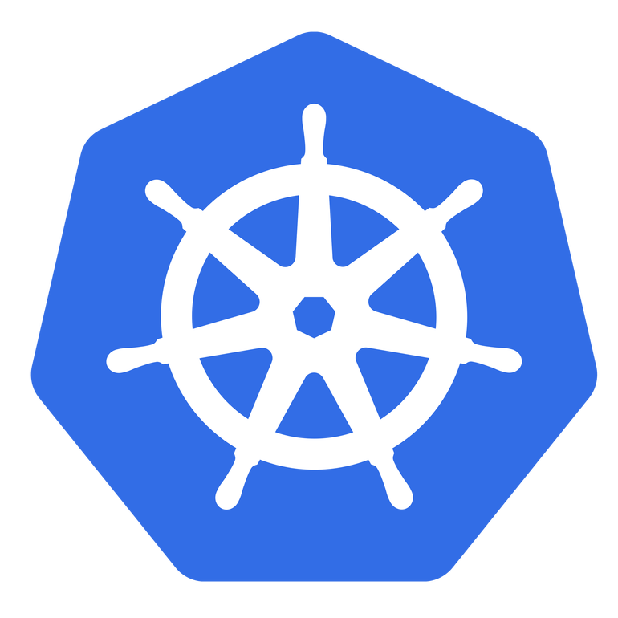
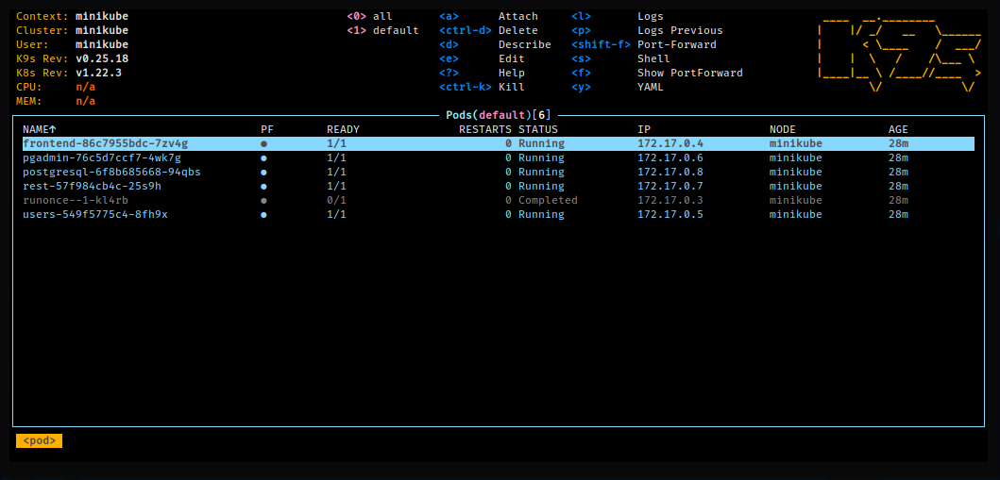

# Deploy usando Kubernetes (e Minikube)

<center>

</center>

Você pode realizar deploy do projeto usando Kubernetes. Nos passos a
seguir, será mostrado como realizar um deploy usando a ferramenta
Minikube, para instalação do Kubernetes localmente.

**ATENÇÃO:** Para detalhes não dispostos nesta página, veja a
[documentação oficial do Kubernetes](https://kubernetes.io/docs/home/).


## Introdução

Kubernetes é uma ferramenta sofisticada de orquestração de contêineres.
O Minerva System é planejado para que seu deploy seja feito utilizando
o Kubernetes.

Para realizar a configuração localmente, fui utilizada a ferramenta
Minikube. Portanto, os comandos aqui abordados partem do pressuposto
de uma instalação local do Kubernetes via Minikube, e podem ser 


## Objetivo

O deploy usando Kubernetes é planejado desde o início do projeto, sendo
uma das formas de estado da arte de deploy de aplicações web. Para
simular este cenário, utilizamos uma instalação local do Kubernetes
via Minikube.

Ainda que Minikube não seja exatamente um servidor do Kubernetes em
produção, boa parte do que será aqui discutido poderá ser utilizado
no momento do deploy para produção.


## Dependências

Você precisará ter instalado:
- Docker versão 20.10 ou superior;
- Docker Compose versão 2.2.3 ou superior;
- Kubectl versão 1.23.3 ou superior;
- [Minikube](https://minikube.sigs.k8s.io/docs/) versão 1.24.0 ou
  superior;
- [k9s](k9scli.io) versão 0.25.18 ou superior (opcional).

A instalação do k9s é opcional, sendo uma ferramenta de monitoramento
e gerencialmento do Kubernetes via linha de comando.


### Iniciando o Minikube

Caso você esteja testando localmente, comece executando o Minikube.

As configurações a seguir iniciam um cluster local via Minikube, usando
KVM2 como backend. Você poderá também usar os backends `docker` ou
`virtualbox`, à escolha.

```bash
minikube start \
	--vm-driver=kvm2 \
	--disable-optimizations=false \
	--extra-config=kubelet.housekeeping-interval=10s

minikube addons enable metrics-server
minikube addons enable ingress
minikube addons enable ingress-dns
```

Se você quiser parar o Minikube:

```bash
minikube stop
```

Igualmente, se quiser remover o cluster:

```bash
minikube delete --all
```

### Problemas com Libvirt e AppArmor

Caso você tenha problemas para inicializar a máquina virtual com KVM2,
pode ser que sua instalação local do AppArmor esteja interferindo com
o `libvirt`.

Como ferramenta paliativa à configuração do AppArmor para o `libvirt`,
você poderá colocar os utilitários usados pelo Minikube no modo _complain_.
Lembre-se de que isso é necessariamente detrimental à segurança do sistema.

```bash
sudo aa-complain /usr/sbin/libvirtd
sudo aa-complain /usr/libexec/virt-aa-helper
```

## Estrutura do Cluster

A seguir, trataremos da estrutura do cluster como atualmente é definido.
As seções a seguir tratam sempre de objetos específicos do Kubernetes,
e são também uma sugestão de ordem de aplicação dos arquivos de configuração.

Todos os arquivos serão encontrados de forma homônima no diretório
`deploy/k8s`, com a extensão `yml`.

Caso queira aplicar todos os arquivos enumerados abaixo, simplesmente execute,
a partir da raiz do projeto:

```bash
kubectl apply -f deploy/k8s
```

### _ConfigMaps_

Um _ConfigMap_ é um objeto que armazena dados que serão utilizados como
variáveis de ambiente de um _pod_.

- `postgresql-configmap`: Variáveis padrão para definições iniciais do
  PostgreSQL 14.
- `mongodb-configmap`: Variáveis padrão para definições iniciais do
  MongoDB 5.
- `runonce-configmap`: Variáveis padrão para definições iniciais do
  Job RUNONCE.
- `frontend-configmap`: Variáveis padrão para uso do Front-End.
- `rest-configmap`: Variáveis padrão para a API REST.
- `ports-configmap`: Portas para acesso aos serviços no cluster.
- `servers-configmap`: Nomes dos serviços a serem acessados. Geralmente
  associados a cada Deployment ou StatefulSet.
- `redis-configmap`: Dados de configuração do Redis. Mais especificamente
  um arquivo `redis.conf` que será recuperado nos _pods_ do Redis através
  da montagem desse _ConfigMap_, como se fosse um volume mutável.
- `mongoexpress-configmap`: Variáveis padrão para definições iniciais do
  Mongo Express.
- `pgadmin-configmap`: Arquivo padrão de configuração de acesso do PgAdmin4.
- `rediscommander-configmap`: Variáveis padrão para definições iniciais do
  Redis Commander.

Para aplicar todos os _ConfigMaps_, execute:

```bash
for f in `ls deploy/k8s/*-configmap.yml`; do
	kubectl apply -f $f
done
```

### _Secrets_

Um _Secret_ é um objeto muito similar a um _ConfigMap_, porém feito
especificamente para lidar com dados sensíveis.

- `runonce-secret`: Dados de criação de campos padrão no banco de dados.
- `pgadmin-secret`: Dados para autenticação no serviço PgAdmin 4.
- `mongoexpress-secret`: Dados para autenticação no MongoDB e no Mongo
  Express.

Para aplicar todos os _Secrets_, execute:

```bash
for f in `ls deploy/k8s/*-secret.yml`; do
	kubectl apply -f $f
done
```

### _PersistentVolumeClaims_

Um _PersistentVolumeClaim_ age como uma reserva de volume persistente
(_PersistentVolume_). Pode associar-se a um volume que exista ou, neste
caso, cria um volume com tamanho específico dinamicamente.

- `postgresql-pvc`: PersistentVolumeClaim para o PostgreSQL. Solicita 1GB
  de armazenamento e criação dinâmica;
- `mongodb-pvc`: PersistentVolumeClaim para o MongoDB. Solicita 1GB de
  armazenamento e criação dinâmica;
- `redis-pvc`: PersistentVolumeClaim para o Redis. Solicita 500MB de
  armazenamento e criação dinâmica.
- `pgadmin-pvc`: PersistentVolumeClaim para as configurações do PgAdmin4.
  Solicita 300MB de armazenamento e criação dinâmica.
  
Para aplicar todos os _PersistentVolumeClaims_, execute:

```bash
for f in `ls deploy/k8s/*-pvc.yml`; do
	kubectl apply -f $f
done
```
  
### _Deployments_

Um _Deployment_ é uma forma de gerenciar _pods_ e suas réplicas. Mais
especificamente, trata-se de uma evolução de um _ReplicaSet_ que permite
a utilização de versionamento.

- `postgresql-deployment`: Deployment para o banco de dados PostgreSQL.
- `mongodb-deployment`: Deployment para o banco de dados MongoDB.
- `frontend-deployment`: Deployment para o Front-End Web do sistema.
- `rest-deployment`: Deployment para o gateway REST do sistema.
- `user-deployment`: Deployment para o microsserviço `USER`.
- `session-deployment`: Deployment para o microsserviço `SESSION`.
- `mongoexpress-deployment`: Deployment para o serviço de monitoramento
  Mongo Express.
- `rediscommander-deployment`: Deployment para o serviço de monitoramento
  Redis Commander.

Para aplicar todos os _Deployments_, execute:

```bash
for f in `ls deploy/k8s/*-deployment.yml`; do
	kubectl apply -f $f
done
```

### _StatefulSets_

Um _StatefulSet_ é exatamente igual a um _Deployment_, porém seus _pods_
são criados com nomes ordinais em vez de aleatórios, de forma que possam
ser individualmente identificados. Além disso, _StatefulSets_ devem ser
utilizados quando o estado interno da aplicação importa.

- `redis-statefulset`: StatefulSet para o cluster do serviço de
  cache do Redis. A réplica `redis-0` será sempre um _Master_, enquanto
  as demais réplicas serão sempre _Slaves_.
- `pgadmin-statefulset`: StatefulSet para o serviço de monitoramento
  PgAdmin 4. Possui apenas uma réplica, e monta o arquivo `servers.json`
  descrito em `pgadmin-configmap` como volume.

Para aplicar todos os _StatefulSets_, execute:

```bash
for f in `ls deploy/k8s/*-statefulset.yml`; do
	kubectl apply -f $f
done
```

### _Services_

Um _Service_ determina a conexão de um ou mais _pods_ com o restante do
cluster ou com a internet. _Services_ podem ser do tipo _ClusterIP_,
_NodePort_ ou _LoadBalancer_. O primeiro tipo expõe os _pods_ apenas para
outros _pods_ do cluster; o segundo e o terceiro expõem para a internet,
com a diferença que um _LoadBalancer_ é a maneira padrão de exposição por
integrar-se com o balanceador de recursos do provedor do cluster.

Além disso, serviços do tipo _LoadBalancer_ agem retroativamente como
_NodePort_, e estes agem também retroativamente como _ClusterIP_.

- `postgresql-svc` (_ClusterIP_): Serviço para acesso interno aos pods
  PostgreSQL.
- `mongodb-svc` (_ClusterIP_): Serviço para acesso interno aos pods
  MongoDB.
- `user-svc` (_ClusterIP_): Serviço para acesso interno aos pods do
  microsserviço USER.
- `session-svc` (_ClusterIP_): Serviço para acesso interno aos pods do
  microsserviço SESSION.
- `frontend-svc` (_LoadBalancer_): Serviço para acesso interno e externo
  aos pods do Front-End Web do sistema.
- `rest-svc` (_LoadBalancer_): Serviço para acesso interno e externo aos
  pods do gateway REST do sistema.
- `redis-svc` (_ClusterIP_): Serviço para acesso interno aos pods do
  Redis.
- `mongoexpress-svc` (_NodePort_): Serviço para acesso interno e externo
  aos pods do Mongo Express. Não interage com balanceador de carga.
- `pgadmin-svc` (_NodePort_): Serviço para acesso interno e externo aos
  pods do PgAdmin 4. Não interage com balanceador de carga.
- `rediscommander-svc` (_NodePort_): Serviço para acesso interno e externo
  aos pods do Redis Commander. Não interage com balanceador de carga.

Caso queira informações sobre as portas exportas por esses serviços, veja
a seção **"Acesso via _NodePort_"** a seguir.

Para aplicar todos os _Services_, execute:

```bash
for f in `ls deploy/k8s/*-svc.yml`; do
	kubectl apply -f $f
done
```

### _Jobs_

Um _Job_ é responsável por criar um _pod_ que executará alguma ação, até
seu completamento ser realizado com sucesso.

- `runonce-job`: Job a ser executado no início do deploy do cluster, para
  configuração inicial. Reiniciará o _pod_ em caso de falhas dez vezes e,
  após sucesso, será removido junto com o _pod_ após cinco minutos.

Para aplicar todos os _ConfigMaps_, execute:

```bash
for f in `ls deploy/k8s/*-job.yml`; do
	kubectl apply -f $f
done
```

### HorizontalPodAutoscalers

Um _HorizontalPodAutoscaler_ é um objeto que interage diretamente com
_Deployments_ e _StatefulSets_, de forma a escalar horizontalmente estes
objetos, através da criação ou remoção de réplicas de seus _pods_.

Estes objetos operam em associação com as especificações requisitadas pelo
_Deployment_ ou _StatefulSet_  em termos de CPU e/ou memória, por exemplo,
garantindo que os _pods_ cheguem no máximo a certa porcentagem de utilização
desses recursos, de acordo com o que foi configurado.

- `rest-hpa`: Escalonador horizontal do gateway REST. Mantém entre 1 e
  15 réplicas para `rest-deployment` com uso médio de 50% do CPU alocado.
- `user-hpa`: Escalonador horizontal do microsserviço USER. Mantém entre
  2 e 6 réplicas para `user-deployment` com uso médio de 65% do CPU alocado.
- `session-hpa`: Escalonador horizontal do microsserviço SESSION. Mantém
  entre 2 e 6 réplicas para `session-deployment` com uso médio de 65%
  do CPU alocado.
- `redis-hpa`: Escalonador horizontal do Redis. Mantém entre 2 e 15
  réplicas para `redis-statefulset` com uso médio de 50% do CPU alocado e
  60% da memória alocada.

Para aplicar todos os _HorizontalPodAutoscalers_, execute:

```bash
for f in `ls deploy/k8s/*-hpa.yml`; do
	kubectl apply -f $f
done
```

### _Ingresses_

Um _Ingress_ é um objeto responsável por gerenciar acesso externo a
serviços no cluster, tipicamente via HTTP.

- `api-ingress`: Ponto de entrada para a API através do URL
  `http://minerva-system.io`. Expõe a API em `/api`.
- `frontend-ingress`: Ponto de entrada para o Front-End através do URL
  `http://minerva-system.io`. Expõe o Front-End em `/`.

Para aplicar todos os _Ingresses_, execute:

```bash
for f in `ls deploy/k8s/*-ingress.yml`; do
	kubectl apply -f $f
done
```

## Acesso via NodePort

Para acessar os serviços expostos via _NodePort_ (ou _LoadBalancer_) no
cluster, diretamente através do IP do Minikube, primeiramente verifique
o endereço IP do cluster. Isso pode ser feito via Kubectl:

```bash
kubectl get node -o wide
```

Isso pode também ser feito através do Minikube:

```bash
minikube ip
```

A seguir, está discriminada uma tabela de todos os serviços acessíveis
via _NodePort_ com suas respectivas portas.

| Serviço         | Porta |
|-----------------|-------|
| API             | 30000 |
| Front-End       | 30001 |
| PgAdmin 4       | 31084 |
| Mongo Express   | 31085 |
| Redis Commander | 31086 |


## Acesso via Ingress

Outra forma de acessar envolve o uso dos objetos _Ingress_. Isso nos
permitirá usar o endereço `http://minerva-system.io/` como URL base
do sistema.

### Usando diretamente o `/etc/hosts`

Comece garantindo que o addon `ingress` esteja habilitado.

Agora, descubra o IP do Minikube na máquina:

```bash
minikube ip
```

Finalmente, edite o arquivo `/etc/hosts` e adicione o seguinte:

```
<ip-do-minikube>	minerva-system.io
```

O Front-End agora poderá ser acessado em `http://minerva-system.io/`,
e a API poderá ser acessada em `http://minerva-system.io/api`.


### Usando o DNS de Ingress do Minikube

Você poderá também usar o Minikube como servidor DNS, evitando de inserir
o URL diretamente em `/etc/hosts`.

Comece garantindo que os addons `ingress` e `ingress-dns` estejam
habilitados. Em seguida, descubra o IP do Minikube:

```bash
minikube ip
```

O Minikube possui uma vasta documentação a respeito de como configurar esse
DNS, mas mostrarei como fazê-lo caso você utiliza SystemD e tiver o ResolveD
instalado (como é o caso de uma instalação pura com Fedora 36).

Edite o arquivo `/etc/systemd/resolved.conf`. Supondo que você use o DNS
do Google, por exemplo, insira o IP do Minikube no DNS e configure um
FallbackDNS também:

```conf
[Resolve]
DNS=192.168.39.97 8.8.8.8
FallbackDNS=8.8.4.4
```

Em seguida, reinicie o ResolveD:

```bash
sudo systemctl restart systemd-resolved
```

Pode ser que a conexão com os demais serviços da internet fiquem ligeiramente
instáveis, _enquanto o Minikube estiver em execução_.

Você poderá verificar se funciona adequadamente com o comando:

```bash
nslookup minerva-system.io
```


## Monitorando via k9s



Uma das ferramentas possíveis de se utilizar para monitorar o cluster
é o `k9s`.

A ferramenta utiliza uma edição modal, muito parecida com o editor
Vim. Os comandos possuem um sistema de autocompletar e são também
mostrados na tela. Alguns comandos interessantes de serem utilizados
são:

- `:q`: Sair da aplicação.
- `:po`: Lista de _Pods_.
- `:svc`: Lista de _Services_.
- `:dp`: Lista de _Deployments_.
- `:ing`: Lista de _Ingresses_.
- `:hpa`: Lista de _HorizontalPodAutoscalers_.
- `:pvc`: Lista de _PersistentVolumeClaims_.
- `:pv`: Lista de _PersistentVolumes_.

Você poderá usar o `k9s` para visualizar logs e também para modificar
algumas propriedades mais avançadas também. É possível até mesmo acessar
diretamente o console dos contêineres.

## Monitorando via dashboard

Você também pode acessar facilmente um dashboard web do Kubernetes,
operando sob o Minikube, caso não queira usar o `k9s` posteriormente
(lembre-se de que objetos como _HorizontalPodAutoscaler_ não são
visíveis nesse Dashboard):

```bash
minikube dashboard
```

## Testes de Stress

Para realizar testes de stress, use o script `deploy/stress_test.sh`.
Você poderá testar cada sistema crucial usando um comando como este:

```bash
./deploy/stress_test.sh minerva-system.io/api user
```

Para maiores informações, execute o script sem argumentos e veja instruções
rápidas de utilização.
