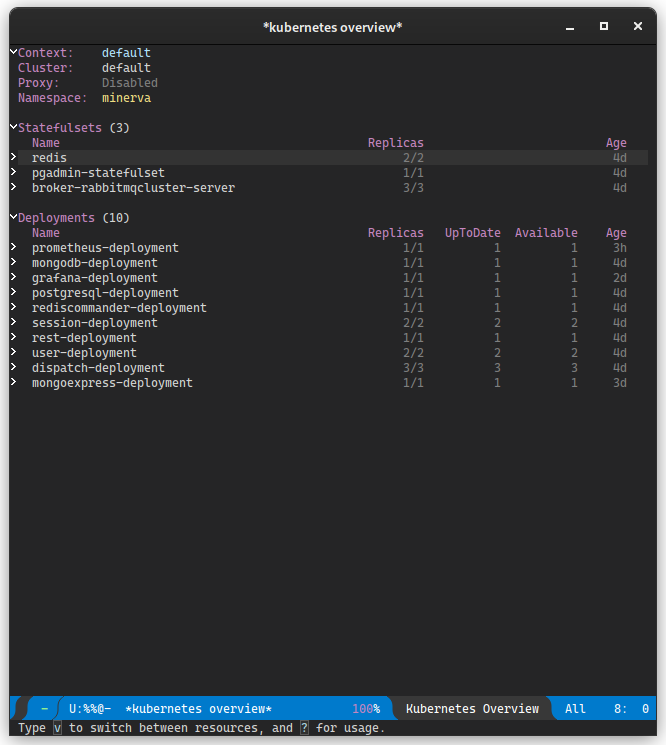

# Deploy usando Kubernetes

<center>

</center>


Você pode realizar deploy do projeto usando Kubernetes. Nos passos a
seguir, será mostrado como realizar deploy em um ambiente Kubernetes.

É importante salientar também que o deploy do Minerva System geralmente
é feito em um ambiente **K3s**, o que pode impactar em algumas formas
de configuração.

## Introdução

Kubernetes é uma ferramenta sofisticada de orquestração de contêineres.
O Minerva System é planejado para que seu deploy seja feito utilizando
o Kubernetes.

## Objetivo

O deploy usando Kubernetes é planejado desde o início do projeto, sendo
uma das formas de estado da arte de *deploy* de aplicações web. Para
simular este cenário, utilizamos uma instalação em um cluster local com
K3s, em computadores cuja arquitetura seja *x86_64* ou *ARM64*.

## Dependências

As configurações de *deploy* são preparadas de forma a utilizar o próprio
*registry* do DockerHub como fonte para as imagens previamente geradas.
Assim, é necessário apenas ter acesso a um cluster com Kubernetes instalado,
algo que pode ser simulado através da ferramenta [K3s](https://k3s.io/).

Para monitoramento e configuração, use as ferramentas a seguir:

- Kubectl v 1.23.3 ou superior, de acordo com o compatível com seu cluster;
- [k9s](k9scli.io) versão 0.25.18 ou superior, para monitoramento (opcional);
- [kubernetes-el](https://kubernetes-el.github.io/kubernetes-el/), pacote do
  editor de texto Emacs que permite monitorar um cluster Kubernetes.

A instalação local do K3s é opcional, e poderia ser substituída pelo
[Minikube](https://minikube.sigs.k8s.io/docs/), porém essa substituição pode
ser impactante na configuração de alguns recursos, especialmente em Ingresses.


## Realizando deploy de serviços

Nos passos a seguir, será mostrado como realizar deploy de cada um dos serviços
e objetos k8s que fazem parte do Minerva System. Recomenda-se seguir os tópicos
em ordem.

Os passos também assumem que a ferramenta `kubectl` esteja configurada
localmente e que tenha acesso ao cluster.

Geralmente, o `kubectl` lê a configuração em `~/.kube/config` por padrão;
caso sua máquina não possua esse arquivo, verifique se consegue obter a
configuração do Kubernetes para substituí-lo. No caso do K3s, esse arquivo
está em `/etc/rancher/k3s/k3s.yaml`, e pode ser copiado, de forma
paliativa, para uma outra máquina, desde que o host do cluster seja adequado
na chave `server`.

### Dependências iniciais

Para realizar o deploy do Minerva System, primeiramente precisaremos
provisionar as dependências iniciais, software externos que são utilizados
pelo resto do sistema.

#### Namespace do sistema

O *namespace* deve ser aplicado para que todos os objetos do sistema existam
dentro do mesmo. Assim, temos uma forma de encapsular o sistema inteiro com
a maior parte de suas dependências.

```bash
kubectl apply -f minerva-namespace.yml
```

#### PostgreSQL

O próximo passo é realizar o deploy do banco de dados relacional.
O Minerva System usa PostgreSQL para tanto. A configuração envolve um
*Secret*, um *PersistentVolumeClaim*, um *Deployment*, e um *Service* de
tipo ClusterIP para garantir que o mesmo só possa ser acessado dentro do
cluster.

```bash
kubectl apply -f postgresql.yml
```

#### MongoDB

Para banco de dados não-relacional, utilizaremos o MongoDB.
O Minerva System usa o MongoDB principalmente para armazenamento de dados
de seção do usuário. A configuração envolve um *Secret*, um
*PersistentVolumeClaim*, um *Deployment*, e um *Service* de tipo ClusterIP,
para que o MongoDB só possa ser acessado dentro do cluster.

```bash
kubectl apply -f mongodb.yml
```

#### Redis

Como serviço de cache, usamos um cluster Redis configurado manualmente.
Esse cluster levanta um mínimo de duas instâncias do Redis, de forma
que uma instância seja mestre e as demais sejam instâncias que operam
como meras réplicas.

O Redis possui um *ConfigMap* que define um arquivo de configuração
para o cluster. Além disso, temos um *PersistentVolumeClaim*, e o cluster
definido através de um *StatefulSet* Temos também um *Service* de tipo
ClusterIP para que ele possa ser acessado, e um *HorizontalPodAutoscaler*
que adiciona ou remove réplicas sob demanda.

```bash
kubectl apply -f redis.yml
```

#### RabbitMQ

O Minerva System usa o RabbitMQ para serviços de mensageria.

O RabbitMQ é utilizado majoritariamente para abrigar mensagens de
operações que possam ser despachadas de forma assíncrona, sem uma
interferência direta do usuário, ou que sejam efeito colateral de outras
operações no sistema.

Para provisionar o RabbitMQ, precisamos provisionar um operador de
cluster para RabbitMQ, e então criar uma instância de cluster do
RabbitMQ, que criará réplicas do serviço de forma eficiente.

##### Operador de cluster

Para realizarmos o deploy de um operador de cluster, utilizaremos o projeto
[RabbitMQ Cluster Operator](https://github.com/rabbitmq/cluster-operator).
O arquivo para deploy do cluster está reproduzido no repositório; igualmente,
sua licença pode ser encontrada em `rabbitmq-cluster-operator.LICENSE`.

```bash
kubectl apply -f rabbitmq-cluster-operator.yml
```

##### Instância do cluster

Agora, para criarmos uma instância do cluster RabbitMQ com três réplicas,
podemos aplicar a configuração criada para o Minerva System. Isso criará
um *StatefulSet* e um *Service* de tipo ClusterIP para o nosso cluster
RabbitMQ.

```bash
kubectl apply -f broker-rabbitmqcluster
```

### Configuração das dependências

Uma vez que as dependências iniciais estejam preparadas, poderemos configurar
os bancos de dados, criar filas de mensagens e preparar *tenants*.

#### Configuração geral de Servers e Portas

Inicialmente, precisaremos criar dois *ConfigMaps*, que registram os hosts
e portas dos serviços que serão criados. Essas configurações são compartilhadas
pela maioria dos serviços.

```bash
kubectl apply -f servers-configmap.yml
kubectl apply -f ports-configmap.yml
```

#### Serviço de preparação

Isso pode ser feito através do módulo RUNONCE, composto de um *ConfigMap*, um
*Secret* e um *Job*. Ao aplicar sua configuração, o *Job* será executado e
preparará as dependências.

```bash
kubectl apply -f minerva-runonce.yml
```

### Módulos do Minerva System

A partir desse momento, podemos começar o deploy dos módulos do Minerva System.
Cada um dos módulos é basicamente uma aplicação *stateless*, sendo geralmente
composto de um *Deployment*, um *Service* de tipo ClusterIP, e um
*HorizontalPodAutoscaler* que criará ou destruirá réplicas dos *Pods* sob demanda.
Alguns módulos também possuem o próprio *ConfigMap* para definir algumas
variáveis de ambiente necessárias.

#### USER

O serviço gRPC de gerenciamento de usuários.

```bash
kubectl apply -f minerva-user.yml
```

#### SESSION

O serviço gRPC de gerenciamento de sessões de usuários.

```bash
kubectl apply -f minerva-session.yml
```

#### DISPATCH

O serviço de despacho de mensagens vindas do RabbitMQ.

Esse serviço não possui um *Service*, já que não pode ser acessado diretamente;
seu único objetivo é despachar mensagens para outros serviços, de acordo com o
que for requisitado através de mensagens via filas no RabbitMQ.

```bash
kubectl apply -f minerva-dispatch.yml
```

#### REST (Gateway)

O serviço REST funciona como um gateway para o back-end do Minerva System.
Através desse serviço, a API poderá ser acessada, e as operações serão
redirecionadas para outros serviços, de acordo com o domínio da regra de
negócio em questão.

REST é o único módulo cujo *Service* possui um tipo diferente, sendo um
tipo LoadBalancer, que fornece acesso direto à API através da porta 30000.

```bash
kubectl apply -f minerva-rest.yml
```

### Utilitários de monitoramento

Com o deploy do sistema feito, poderemos também provisionar algumas ferramentas
para ajudar no monitoramento do mesmo.

#### Prometheus

O Prometheus é um serviço que realiza scraping de informações expostas em endpoints
de métricas. Através dele, é possível recuperar dados que podem ser posteriormente
trabalhados para analisar a saúde de serviços ou até mesmo do cluster Kubernetes.

##### Configurando o k3s

Primeiramente, configure a sua instância do K3s, como orienta
[esse link](https://fabianlee.org/2022/07/02/prometheus-installing-kube-prometheus-stack-on-k3s-cluster/);
basta apenas, no seu nó *master* do cluster, criar o arquivo
`/etc/rancher/k3s/config.yaml` com o conteúdo:

```yaml
etcd-expose-metrics: true
```

Em seguida, reinicie o serviço do K3s.

##### Instalando o Kube-State-Metrics

O serviço kube-state-metrics provê algumas métricas coletadas através dos serviços
no cluster Kubernetes. Voce pôderá instalar uma configuração padrão, como colocado
[neste link](https://chrisedrego.medium.com/kubernetes-monitoring-kube-state-metrics-df6546aea324),
clonando o repositório do projeto e aplicando essa configuração:

```bash
git clone https://github.com/kubernetes/kube-state-metrics
kubectl apply -f kube-state-metrics/examples/standard/
```

##### Provisionando o Prometheus

Como o Prometheus realiza scraping de dados nos serviços do Kubernetes e até mesmo
em outros serviços, ele necessita de configurações de RBAC, o que implica na
criação de objetos como *ClusterRoles*, *ClusterRoleBindings* e *ServiceAccounts*.
Além disso, o Prometheus possui arquivos de configuração em um *ConfigMap*,
um *Deployment* e um *Service*.

```bash
kubectl apply -f util/prometheus.yml
```

#### Mongo Express

O Mongo Express é uma ferramenta para explorar e editar o conteúdo do
banco de dados não-relacional MongoDB. Esse serviço é exposto através de
um *Service* de tipo NodePort, na porta `31085`.

O Mongo Express do Minerva já vem configurado com configuração de acesso
ao MongoDB. Caso sejam requisitadas credenciais para abrir o aplicativo,
utilize o usuário `mongo` e a senha `mongo`.

**ATENÇÃO:** Caso seja necessário usar uma ferramenta mais específica, como
MongoDB Compass, você poderá realizar port-forward do *Deployment* do MongoDB
e conectar-se à porta via `localhost`.

```bash
kubectl apply -f util/mongoexpress.yml
```

#### PgAdmin4

O PgAdmin4 é uma ferramenta para explorar e editar o conteúdo do banco de
dados relacional PostgreSQL. Esse serviço é exposto através de um *Service*
de tipo NodePort, na porta `31084`.

O PgAdmin4 do Minerva já vem configurado com dados de acesso ao PostgreSQL.
Para efetuar login, use o usuário `admin@admin.com` e a senha `admin`.
Para acessar o PostgreSQL, você precisará do usuário e senha padrão do
mesmo também (`postgres` para ambos, por padrão).

**ATENÇÃO:** Caso seja necessário usar uma ferramenta mais específica, como
DBeaver, você poderá realizar port-forward do *Deployment* do PostgreSQL
e conectar-se à porta via `localhost`.

```bash
kubectl apply -f util/pgadmin.yml
```

#### Grafana

O Grafana é um serviço para criação e mostra de dashboards que operam
a partir de métricas coletadas em serviços variados. No caso do Minerva,
esses dados vêm principalmente do serviço Prometheus, previamente configurado.

Para o Grafana, provisionaremos alguns *ConfigMaps* com configuração
inicial e alguns dashboards padrão para o cluster RabbitMQ. Como essa
configuração inicial produz um arquivo relativamente grande, é necessário
forçá-lo a ser processado de forma *server-side*.

As credenciais padrão do Grafana são o usuário `admin` e senha `admin`.
Durante o primeiro login, você poderá alterar a senha inicial.

```bash
kubectl apply -f --server-side=true util/grafana-data.yml
kubectl apply -f util/grafana.yml
```

Para mais detalhes da configuração do Grafana, veja a página de
[Ferramentas para monitoramento externo.](./ferramentas-monitoramento-externas.md)

### Ingresses (via Traefik)

Os Ingresses são formas mais explícitas de acesso a alguns serviços
do cluster, pois abrem rotas propriamente ditas que "camuflam" requisições
nas mesmas e realizam forwarding para serviços específicos.

Os Ingresses atualmente preparados são compatíveis com a infraestrutura
padrão do K3s, que utiliza Traefik como proxy reverso de Ingresses padrão.

Atualmente, os ingresses exportam as seguintes rotas:

- `/api`, para a API do Minerva System;
- `/pgadmin`, para o PgAdmin4;
- `/mongoexpress`, para o Mongo Express;
- `/grafana`, para o Grafana.

```bash
kubectl apply -f minerva-ingress.yml
```

## Acessando serviços externamente

Pode ser necessário acessar, de forma externa, algum serviço
que esteja no cluster, especialmente se o mesmo possuir um
*Service* do tipo ClusterIP, que não permite acesso externo
diretamente.

O Kubernetes provê algumas formas de realizar este acesso.

### Acessando com Port Forward

Uma forma muito útil de acesso externo é o *port forwarding*,
que realiza *bind* de uma porta da máquina local a uma porta
específica de um *pod* específico. Também é possível referenciar
um conjunto inteiro de réplicas através de um *Deployment*,
*ReplicaSet* ou *StatefulSet*.

Para tanto, basta ter o `kubectl` instalado na sua máquina e
a configuração correta de acesso ao cluster.

O exemplo a seguir realiza *port forwarding* do MongoDB para
a máquina local, de forma que a porta `27017` do *pod*
esteja acessível localmente através da porta `9050`. Esse
tipo de manobra será útil especialmente para acesso externo,
por exemplo, au usar o MongoDB Compass.

```bash
kubectl port-forward deployment/mongodb-deployment 9050:27017
```

### Acesso via NodePort

Esse tipo de acesso envolve acessar alguns *Services* que
possuam um tipo NodePort ou LoadBalancer, estando expostos
sob uma porta em qualquer IP do cluster. A tabela a seguir
mostra uma relação dessas portas.

| Serviço             | Porta |
|---------------------|-------|
| API                 | 30000 |
| PgAdmin 4           | 31084 |
| Mongo Express       | 31085 |
| Redis Commander     | 31086 |
| Grafana             | 31087 |


## Monitoramento e testes

A seguir, estão listadas algumas configurações relacionadas a
utilitários de monitoramento e testes do Minerva no cluster.

### k9s


Uma das ferramentas possíveis de se utilizar para monitorar o cluster
é o `k9s`.

A ferramenta utiliza uma edição modal, muito parecida com o editor
Vim. Os comandos possuem um sistema de autocompletar e são também
mostrados na tela. Alguns comandos interessantes de serem utilizados
são:

- `:q`: Sair da aplicação.
- `:po`: Lista de _Pods_.
- `:svc`: Lista de _Services_.
- `:dp`: Lista de _Deployments_.
- `:ing`: Lista de _Ingresses_.
- `:hpa`: Lista de _HorizontalPodAutoscalers_.
- `:pvc`: Lista de _PersistentVolumeClaims_.
- `:pv`: Lista de _PersistentVolumes_.

Você poderá usar o `k9s` para visualizar logs e também para modificar
algumas propriedades mais avançadas também. É possível até mesmo acessar
diretamente o console dos contêineres.

### kubernetes-el




O `kubernetes-el` é um pacote para o editor de texto Emacs que
permite inspecionar um cluster Kubernetes.

Para mais informações, veja o
[site oficial do pacote](https://kubernetes-el.github.io/kubernetes-el/).

### Dashboard do Kubernetes

É possível acessar o Dashboard padrão do Kubernetes para realizar
gerenciamento e monitoramento, porém o K3s exige configuração extra.

Para ter acesso ao Dashboard,
[siga as orientações](https://rancher.com/docs/k3s/latest/en/installation/kube-dashboard/)
no site oficial da Rancher.

### Testes de Stress

Há alguns testes de stress para o Minerva System. Estes testes servem principalmente para
testar os limites e o comportamento do sistema quando o mesmo estiver sob uma grande carga
de operações.

#### Testes de spike com K6

Os testes padrão são realizados através da ferramenta [K6](https://k6.io/), porém essa
ferramenta demanda a extensão Faker para que funcione adequadamente. Você poderá
encontrar as instruções de instalação dessa extensão
[no repositório da mesma](https://github.com/szkiba/xk6-faker).

No diretório `deploy/tests/k6`, você poderá executar o `k6` compilado com a extensão
referida. O host do cluster deverá ser informado através da variável de ambiente
`MINERVA_HOST`. Note que o `k6` assume que o host informado possua uma rota `/api`,
então você deverá garantir que o Ingress do cluster esteja funcionando.

O exemplo a seguir mostra como executar os spike tests para stress de operações de
sessão e de usuários.

```bash
# Testes de sessão
MINERVA_HOST=http://$IP_DO_CLUSTER k6 run session_spike.js

# Testes de usuários
MINERVA_HOST=http://$IP_DO_CLUSTER k6 run users_spike.js
```

A execução dos testes gerará um arquivo `html` ao final, que mostra um formato
interativo para inspeção dos resultados de testes.

#### Testes de stress legados (via Bash)

Para realizar testes de stress com o formato legado, use o script
`deploy/tests/legacy/stress_test.sh`.

Você poderá testar cada sistema crucial usando um comando como este:

```bash
./deploy/tests/legacy/stress_test.sh $IP_DO_CLUSTER/api user
```

Para maiores informações, execute o script sem argumentos e veja instruções
rápidas de utilização.
