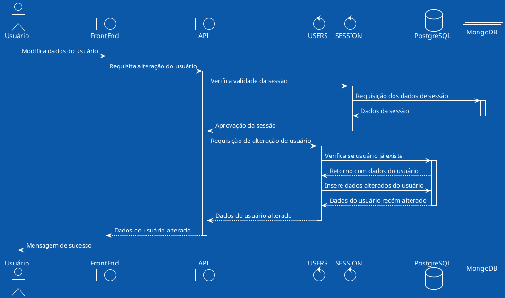

# Alteração do cadastro de usuários

```plantuml
@startuml
!theme amiga
actor       Usuário    as ator
boundary    FrontEnd   as frontend
boundary    API        as api
control     USERS      as users
control     SESSION    as session
database    PostgreSQL as postgres
collections MongoDB    as mongo

ator     ->  frontend:     Modifica dados do usuário
frontend ->  api:          Requisita alteração do usuário
activate api
api      ->  session:      Verifica validade da sessão
activate session
session  ->  mongo:        Requisição dos dados de sessão
activate mongo
session  <-- mongo:        Dados da sessão
deactivate mongo
api      <-- session:      Aprovação da sessão
deactivate session

api      ->  users:        Requisição de alteração de usuário
activate users
users    ->  postgres:     Verifica se usuário já existe
activate postgres
users    <-- postgres:     Retorno com dados do usuário
users    ->  postgres:     Insere dados alterados do usuário
users    <-- postgres:     Dados do usuário recém-alterado
deactivate postgres
api      <-- users:        Dados do usuário alterado
deactivate users
frontend <-- api:          Dados do usuário alterado
deactivate api
ator     <-- frontend:     Mensagem de sucesso

@enduml
```

