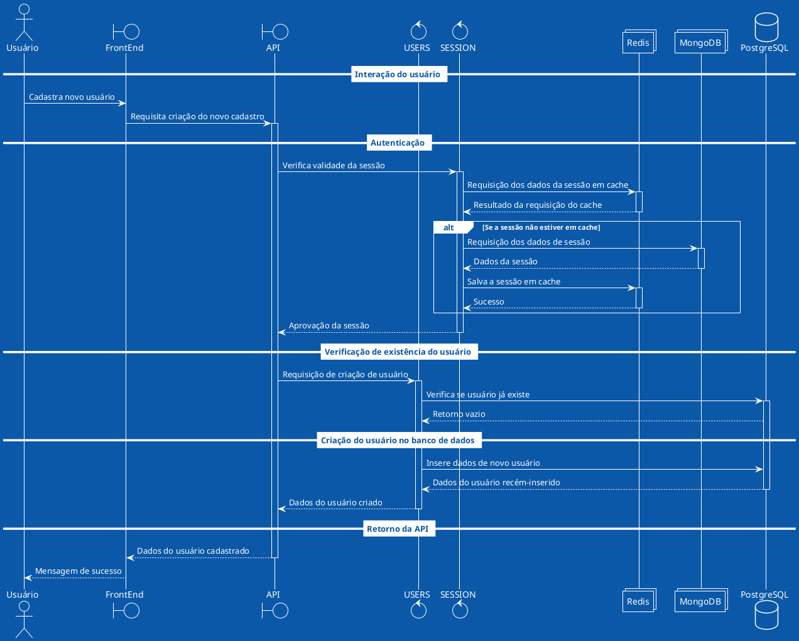

# Cadastro de usuários

```plantuml
@startuml
!theme amiga
actor       Usuário    as ator
boundary    FrontEnd   as frontend
boundary    API        as api
control     USERS      as users
control     SESSION    as session
collections Redis      as redis
collections MongoDB    as mongo
database    PostgreSQL as postgres

== Interação do usuário ==

ator     ->  frontend:     Cadastra novo usuário
frontend ->  api:          Requisita criação do novo cadastro
activate api

== Autenticação ==

api      ->  session:  Verifica validade da sessão
activate session
session  ->  redis:    Requisição dos dados da sessão em cache
activate redis
session  <-- redis:    Resultado da requisição do cache
deactivate redis

alt Se a sessão não estiver em cache
	session ->  mongo: Requisição dos dados de sessão
	activate mongo
	session <-- mongo: Dados da sessão
	deactivate mongo
	session ->  redis: Salva a sessão em cache
	activate redis
	session <-- redis: Sucesso
	deactivate redis
end

api   <-- session:  Aprovação da sessão
deactivate session

== Verificação de existência do usuário ==

api      ->  users:        Requisição de criação de usuário
activate users
users    ->  postgres:     Verifica se usuário já existe
activate postgres
users    <-- postgres:     Retorno vazio

== Criação do usuário no banco de dados ==

users    ->  postgres:     Insere dados de novo usuário
users    <-- postgres:     Dados do usuário recém-inserido
deactivate postgres
api      <-- users:        Dados do usuário criado
deactivate users

== Retorno da API ==

frontend <-- api:          Dados do usuário cadastrado
deactivate api
ator     <-- frontend:     Mensagem de sucesso

@enduml
```

