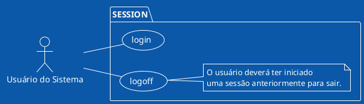
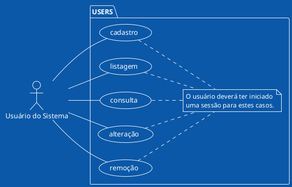
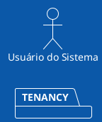
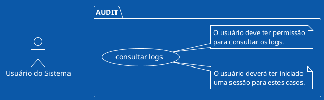
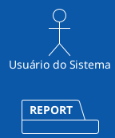
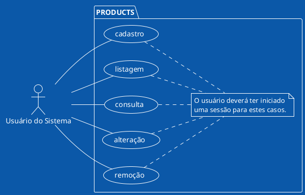
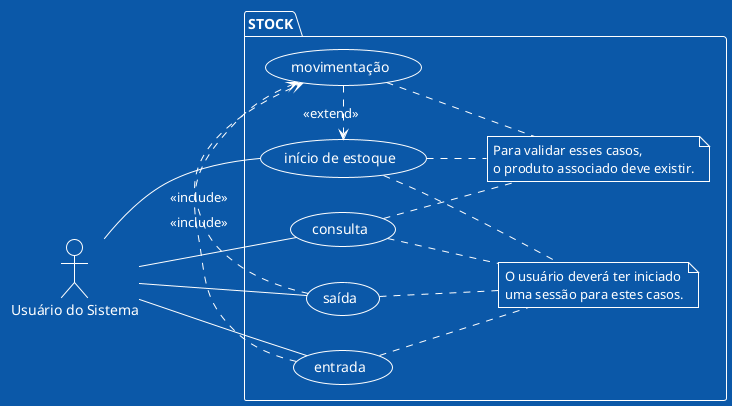
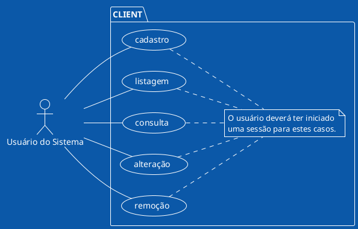
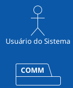

# Diagramas de Casos de Uso

Os diagramas a seguir representam casos de uso para o sistema. Esses diagramas
não têm a pretensão de serem completos, mas sim de ilustrar funcionalidades
esperadas para o sistema, de forma visual.

Os casos de uso foram subdivididos em domínios, que poderão ilustrar os
microsserviços envolvidos.

## Sessão

## Usuários

## Inquilinos

## Auditoria

## Relatórios

## Produtos

## Estoque

## Clientes

## Comunicação Instantânea

