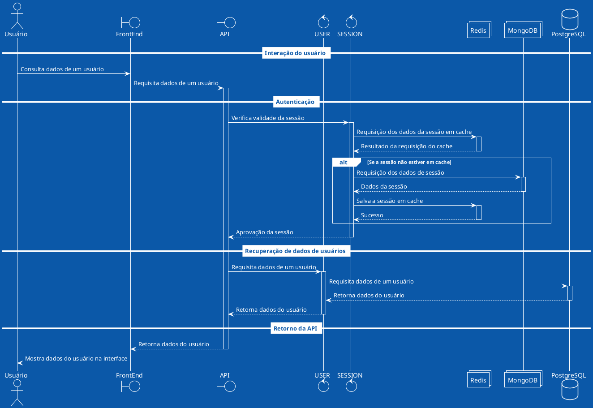

# Consultar usuário

```plantuml
@startuml
!theme amiga
actor       Usuário    as ator
boundary    FrontEnd   as frontend
boundary    API        as api
control     USER      as user
control     SESSION    as session
collections Redis      as redis
collections MongoDB    as mongo
database    PostgreSQL as postgres

== Interação do usuário ==

ator     ->  frontend:     Consulta dados de um usuário
frontend ->  api:          Requisita dados de um usuário
activate api

== Autenticação ==

api      ->  session:  Verifica validade da sessão
activate session
session  ->  redis:    Requisição dos dados da sessão em cache
activate redis
session  <-- redis:    Resultado da requisição do cache
deactivate redis

alt Se a sessão não estiver em cache
	session ->  mongo: Requisição dos dados de sessão
	activate mongo
	session <-- mongo: Dados da sessão
	deactivate mongo
	session ->  redis: Salva a sessão em cache
	activate redis
	session <-- redis: Sucesso
	deactivate redis
end

api   <-- session:  Aprovação da sessão
deactivate session

== Recuperação de dados de usuários ==

api -> user:              Requisita dados de um usuário
activate user
user -> postgres:         Requisita dados de um usuário
activate postgres
user <-- postgres:        Retorna dados do usuário
deactivate postgres
api <-- user:             Retorna dados do usuário
deactivate user

== Retorno da API ==

frontend <-- api:          Retorna dados do usuário
deactivate api
ator <-- frontend:         Mostra dados do usuário na interface

@enduml
```

