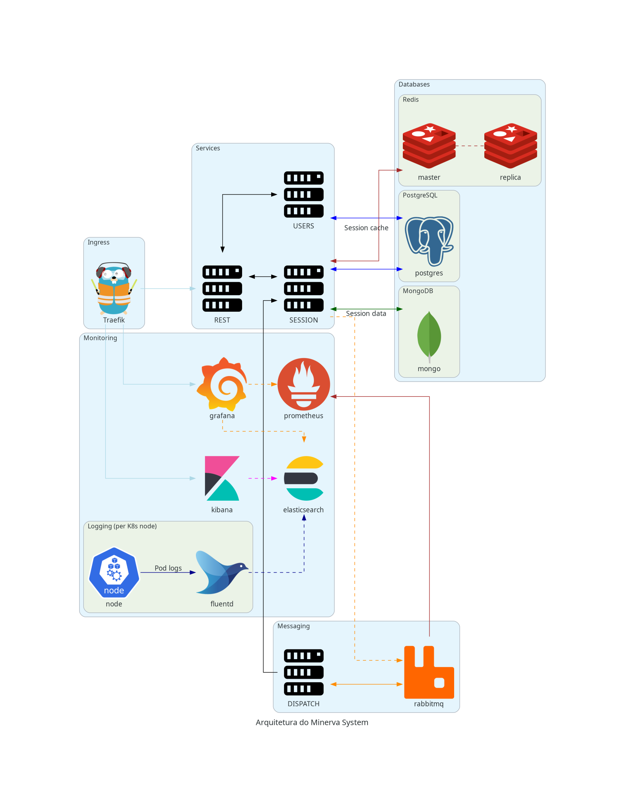

# Diagramas de arquitetura do cluster

Esta seção contém diagramas relacionados à arquitetura do Minerva System, quando
realizado o seu _deploy_ através do uso de Kubernetes.

Nesta página, você poderá observar a arquitetura do sistema de forma geral.
As próximas subseções mostram diagramas específicos demonstrando o _deployment_
de cada um dos componentes necessários no Kubernetes.

