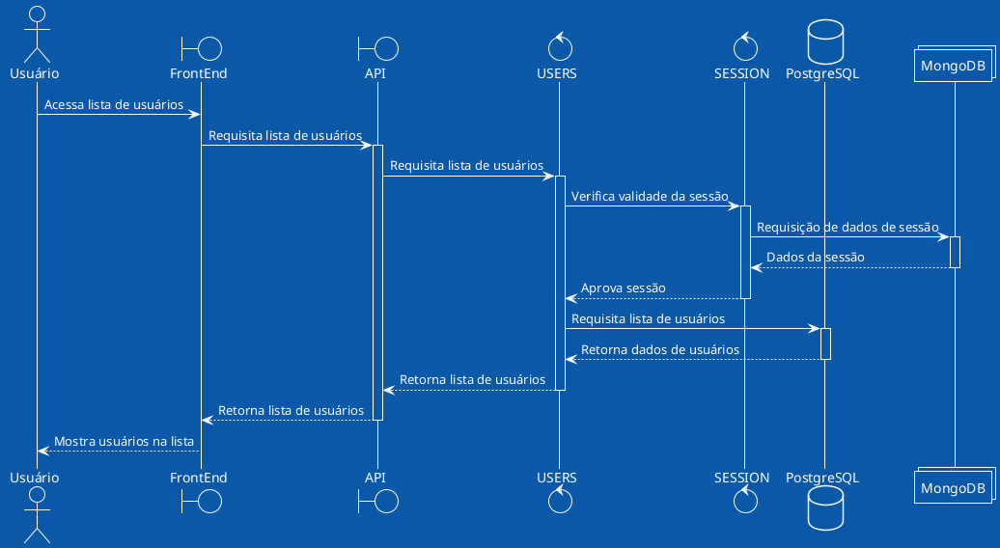

# Listagem de usuários

```plantuml
@startuml
!theme amiga
actor       Usuário    as ator
boundary    FrontEnd   as frontend
boundary    API        as api
control     USERS      as users
control     SESSION    as session
database    PostgreSQL as postgres
collections MongoDB    as mongo


ator -> frontend: Acessa lista de usuários
frontend -> api: Requisita lista de usuários
activate api
api -> users: Requisita lista de usuários
activate users
users -> session: Verifica validade da sessão
activate session
session  ->   mongo: Requisição de dados de sessão
activate mongo
session  <--  mongo: Dados da sessão
deactivate mongo
users <-- session: Aprova sessão
deactivate session
users -> postgres: Requisita lista de usuários
activate postgres
users <-- postgres: Retorna dados de usuários
deactivate postgres
api <-- users: Retorna lista de usuários
deactivate users
frontend <-- api: Retorna lista de usuários
deactivate api
ator <-- frontend: Mostra usuários na lista

@enduml
```

