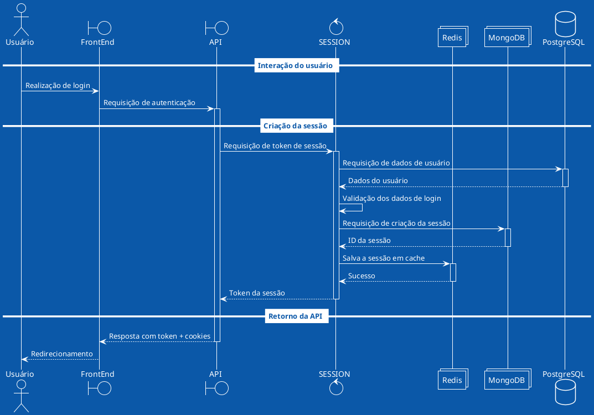

# Login do usuário

Após o _login_ ser realizado, as sessões no Redis e no MongoDB obedecem um tempo
de vida limitado.

- **Redis**: Algumas horas.
- **MongoDB**: Uma semana.

Isso é gerenciado pelos próprios serviços. O MongoDB fará isso através do tempo
de vida da coleção para aquele banco, enquanto o Redis fará isso através do
tempo de vida da informação quando a mesma foi colocada em cache.

**TODO:** Seria mais adequado fazer com que `SESSION` requeira a `USERS` os
dados dos usuários, ao invés de recorrer ao banco?

