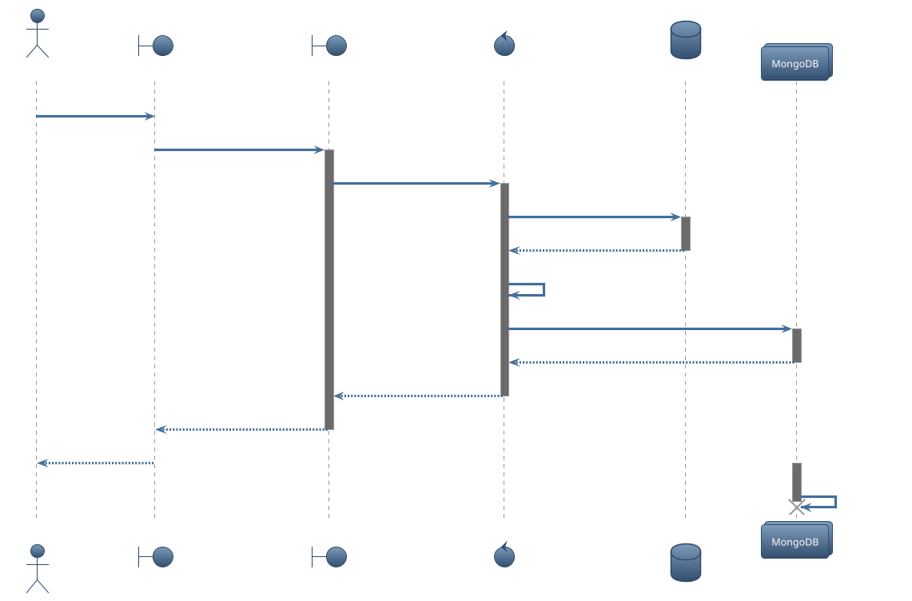

# Login do usuário

```plantuml
@startuml
!theme spacelab

actor       Usuário    as ator
boundary    FrontEnd   as frontend
boundary    API        as api
control     SESSION    as session
database    PostgreSQL as postgres
collections MongoDB    as mongo

ator     ->   frontend: Realização de login
frontend ->   api:      Requisição de autenticação
activate api
api      ->   session:  Requisição de token de sessão
activate session
session  ->   postgres: Requisição de dados de usuário
activate postgres
session  <--  postgres: Dados do usuário
deactivate postgres
session  ->   session:  Validação dos dados de login
session  ->   mongo:    Requisição de criação da sessão
activate mongo
session  <--  mongo:    ID da sessão
deactivate mongo
api      <--  session:  Token da sessão
deactivate session
frontend <--  api:      Resposta com token + cookies
deactivate api
ator     <--  frontend: Redirecionamento

activate mongo
mongo -> mongo: Remoção da sessão
destroy mongo

@enduml
```

