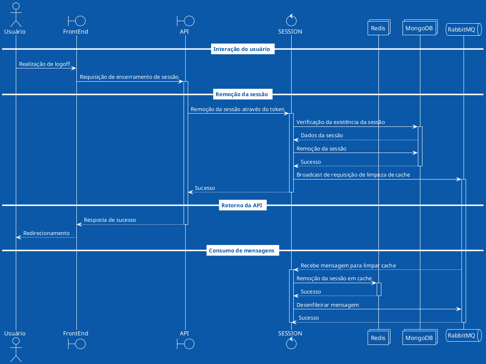

# Logoff do usuário

```plantuml
@startuml
!theme amiga
actor       Usuário    as ator
boundary    FrontEnd   as frontend
boundary    API        as api
control     SESSION    as session
collections Redis      as redis
collections MongoDB    as mongo
queue       RabbitMQ   as rmq

== Interação do usuário ==

ator     ->   frontend: Realização de logoff
frontend ->   api:      Requisição de encerramento de sessão
activate api

== Remoção da sessão ==

api      ->   session:  Remoção da sessão através do token
activate session
session  ->   mongo:    Verificação da existência da sessão
activate mongo
session  <--  mongo:    Dados da sessão
session  ->   mongo:    Remoção da sessão
session  <--  mongo:    Sucesso
deactivate mongo

session  ->   rmq:      Broadcast de requisição de limpeza de cache
activate rmq
api      <--  session:  Sucesso
deactivate session

== Retorno da API ==

frontend <--  api:      Resposta de sucesso
deactivate api
ator     <--  frontend: Redirecionamento

== Consumo de mensagens ==

session  <--  rmq:      Recebe mensagem para limpar cache
activate session
session  ->   redis:    Remoção da sessão em cache
activate redis
session  <--  redis:    Sucesso
deactivate redis
session  ->   rmq:      Desenfileirar mensagem
session  <--  rmq:      Sucesso
deactivate rmq
deactivate session

@enduml
```

