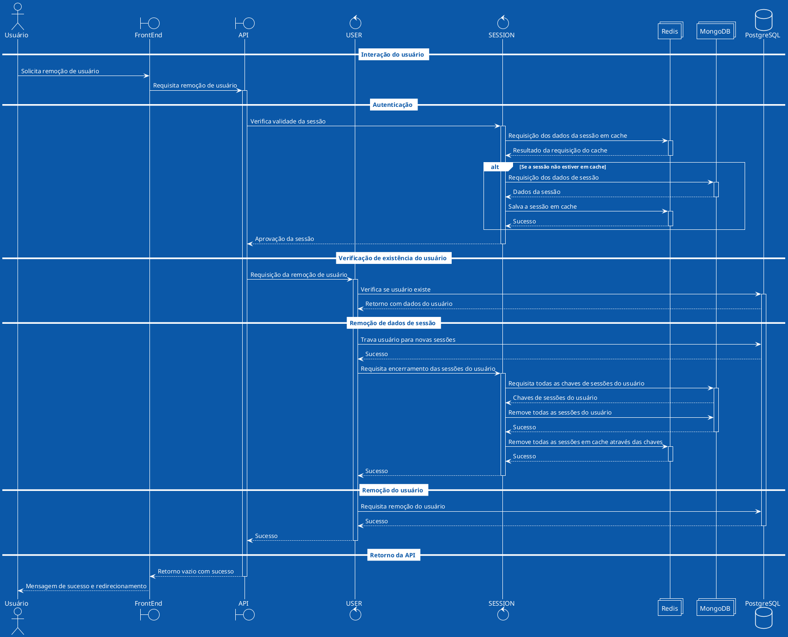

# Remoção de usuários

```plantuml
@startuml
!theme amiga
actor       Usuário    as ator
boundary    FrontEnd   as frontend
boundary    API        as api
control     USER      as user
control     SESSION    as session
collections Redis      as redis
collections MongoDB    as mongo
database    PostgreSQL as postgres


== Interação do usuário ==

ator     ->  frontend: Solicita remoção de usuário
frontend ->  api:      Requisita remoção de usuário
activate api

== Autenticação ==

api      ->  session:  Verifica validade da sessão
activate session
session  ->  redis:    Requisição dos dados da sessão em cache
activate redis
session  <-- redis:    Resultado da requisição do cache
deactivate redis

alt Se a sessão não estiver em cache
	session ->  mongo: Requisição dos dados de sessão
	activate mongo
	session <-- mongo: Dados da sessão
	deactivate mongo
	session ->  redis: Salva a sessão em cache
	activate redis
	session <-- redis: Sucesso
	deactivate redis
end

api   <-- session:  Aprovação da sessão
deactivate session

== Verificação de existência do usuário ==

api   ->  user:    Requisição da remoção de usuário
activate user
user ->  postgres: Verifica se usuário existe
activate postgres
user <-- postgres: Retorno com dados do usuário

== Remoção de dados de sessão ==

user   ->  postgres: Trava usuário para novas sessões
user   <-- postgres: Sucesso
user   ->  session:  Requisita encerramento das sessões do usuário
activate session
session ->  mongo:    Requisita todas as chaves de sessões do usuário
activate mongo
session <-- mongo:    Chaves de sessões do usuário
session ->  mongo:    Remove todas as sessões do usuário
session <-- mongo:    Sucesso
deactivate mongo
session ->  redis:    Remove todas as sessões em cache através das chaves
activate redis
session <-- redis:    Sucesso
deactivate redis
user   <-- session:  Sucesso
deactivate session

== Remoção do usuário ==

user    -> postgres:  Requisita remoção do usuário
user    <-- postgres: Sucesso
deactivate postgres
api      <-- user:    Sucesso

== Retorno da API ==

deactivate user
frontend <-- api:      Retorno vazio com sucesso
deactivate api
ator     <-- frontend: Mensagem de sucesso e redirecionamento

@enduml
```

