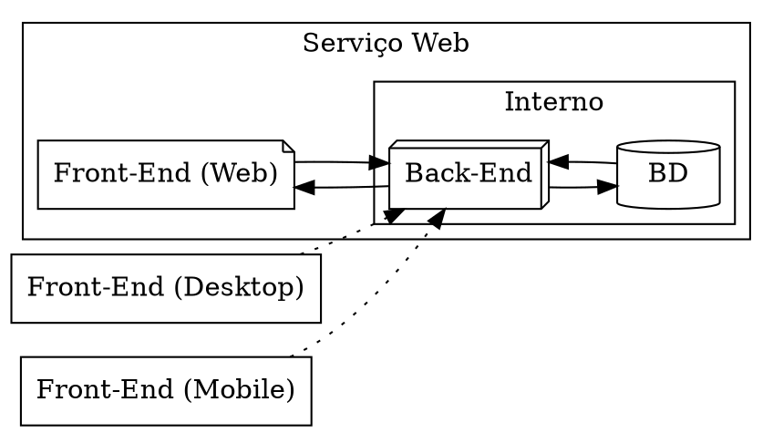

# Estrutura geral do projeto

O projeto Minerva é uma aplicação pensada com finalidade de estudo, mas que
não deixa de ser um sistema real e com um público alvo. Sendo assim, trata-se
de um sistema gerencial pensado para pequenos negócios, *sem finalidade comercial*.

O projeto envolve um licenciamento de Software Livre, e busca implementar uma
estrutura de microsserviços. Em outras palavras, o sistema opera através da modificação
de uma única base de dados, mas possui modulos separados para modificação de partes
específicas.

Minerva também utiliza uma dicotomia front-end/back-end, de forma que a aplicação
constitui-se de uma interface gráfica web, acessível via navegador, e uma intraestrutura
constituída de um ponto de entrada que se comunica com os serviços específicos que
a interface gráfica requisitar.

## Serviços

Como supracitado, Minerva constitui-se de microsserviços, especialmente em seu back-end.
Para tanto, deve-se pensar em três grandes serviços:

- Front-End (aplicação web envolvendo interface gráfica, feita em alguma tecnologia
  para tal, como Flutter);
- Back-End (aplicação com ponto de entrada REST, constituída de microsserviços, com
  comunicação interna via gRPC);
- Banco de Dados (PostgreSQL 14, que pode ser utilizado em um contêiner Docker para
  intuitos de debug apenas).

Adicionalmente, será possível manter uma maleabilidade que permita a confecção de outros
tipos de Front-Ends que se comuniquem diretamente com o Back-End da aplicação, como
por exemplo, através de programas nativos para Desktop e Mobile.

