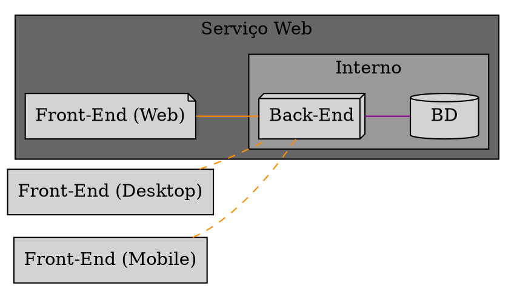

# Estrutura geral do projeto

O Minerva System é uma aplicação pensada com finalidade de estudo, mas que
não deixa de ser um sistema real e com um público alvo. Sendo assim, trata-se
de um sistema gerencial, *sem finalidade comercial*.

O projeto envolve um licenciamento de Software Livre, e busca implementar uma
estrutura de microsserviços. Em outras palavras, o sistema opera através da modificação
de uma única base de dados, mas possui módulos separados para modificação de partes
específicas.

Minerva também utiliza uma dicotomia front-end/back-end, de forma que a aplicação
constitui-se de uma interface gráfica web, acessível via navegador, e uma intraestrutura
constituída de um ponto de entrada que se comunica com os serviços específicos que
a interface gráfica requisitar.

## Segmentos

Como supracitado, Minerva constitui-se de microsserviços, especialmente em seu back-end.
Para tanto, deve-se pensar em três grandes segmentos:

- Front-End (aplicação web envolvendo interface gráfica);
- Back-End (aplicação com um _gateway_ REST, constituída de microsserviços gRPC);
- Banco de Dados (relacional para gerenciamento de dados, não-relacional para
  gerenciamento de entidades temporárias, e sistemas de caching e mensageria).

Adicionalmente, existe uma maleabilidade que permite a confecção de outros tipos de Front-End
que se comuniquem diretamente com o Back-End da aplicação, como por exemplo, através de
programas nativos para Desktop e Mobile.

A imagem a seguir é uma **supersimplificação** da visão externa do sistema, sem sua complexidade
intrínseca.

