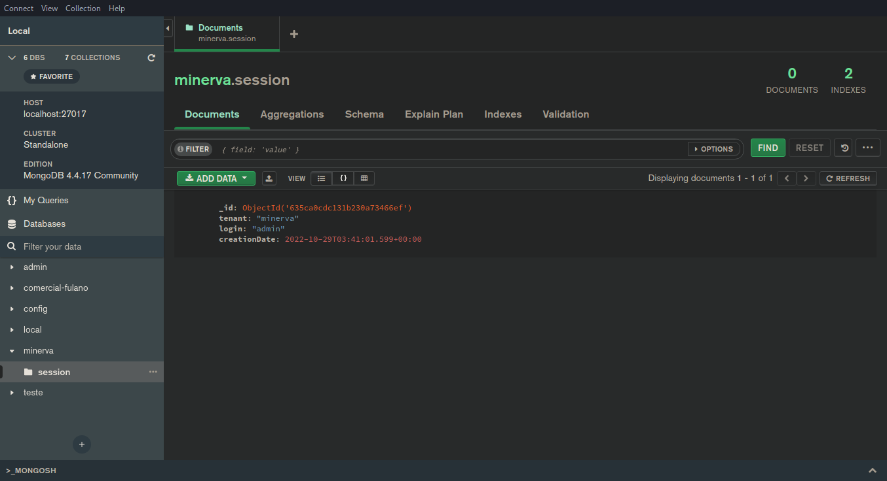
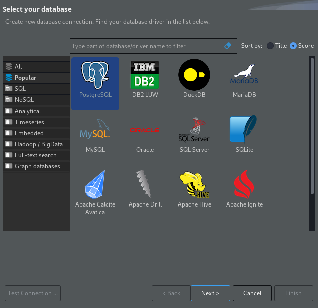

# Ferramentas para monitoramento externo

Esta seção demonstra algumas ferramentas que podem ser utilizadas para
monitoramento dos serviços cujo _deploy_ tenha sido realizado por meio de
Kubernetes.

A maioria dos serviços a seguir pode ser acessado através de _port-forward_.

## MongoDB Compass (para MongoDB)

<center>

</center>

O MongoDB Compass é uma ferramenta para desktop que permite inspecionar
documentos no MongoDB.

Para utilizá-lo, primeiramente realize _port-forward_ do MongoDB para
sua porta padrão na máquina atual:

```bash
kubectl port-forward -n minerva deployment/mongodb-deployment 27017:27017
```

Em seguida, conecte-se à instância do MongoDB através do host *`localhost:27017`*,
com usuários e senha padrão `root` e `mongo`.

<center>

</center>


## RESP.app (para Redis)

<center>

</center>

O RESP.app é uma ferramenta para desktop que permite inspecionar dados em cache
em um serviço Redis ou Redis Cluster.

Para acessar o Redis através dele, realize primeiro o _port-forward_ para
a porta padrão do Redis na sua máquina:

```bash
kubectl port-forward -n minerva statefulset/redis 6379:6379
```

Em seguida, clique em _Connect To Redis Server_. No campo de URL, digite o mesmo
texto do _hint_ apresentado (`redis://localhost:6379`), e então clique em _Import_.

Na próxima janela, dê um nome para a conexão e clique em OK. Não é necessário
segurança ou autenticação.

<center>

</center>


## DBeaver Community Edition (para PostgreSQL)

<center>

</center>

O DBeaver é um cliente universal para banco de dados que permite inspecionar tabelas,
schemas, e executar código SQL.

Para acessar o banco de dados PostgreSQL através dele, primeiramente exponha o banco
do cluster localmente através de _port-forward_ na porta padrão esperada:

```bash
kubectl port-forward -n minerva deployment/postgresql-deployment 5432:5432
```

Em seguida, abra o DBeaver e clique na opção para uma nova conexão, no menu
_Banco de dados_ (ou _Database_). Selecione a opção PostgreSQL, clique em _Next_,
e instale quaisquer drivers necessários que venham a ser pedidos.

<center>

</center>


Em seguida, você poderá manter o host e porta padrões (`localhost:5432`), mas
deverá alterar o campo _Database_ de acordo com o _tenant_ que você deseja acessar.

Além disso, por padrão, use usuário `postgres` e senha `postgres`.

<center>

</center>

Você poderá agora navegar nas abas à esquerda para localizar quaisquer tabalas que
desejar, e poderá também fazer outras operações com o banco.

<center>

</center>


## RabbitMQ

<!-- Mencionar port-forward -->
<!-- Mencionar acesso web -->


## Grafana

<!-- Mencionar ingress -->
<!-- Migrar dashboards úteis para cá -->
