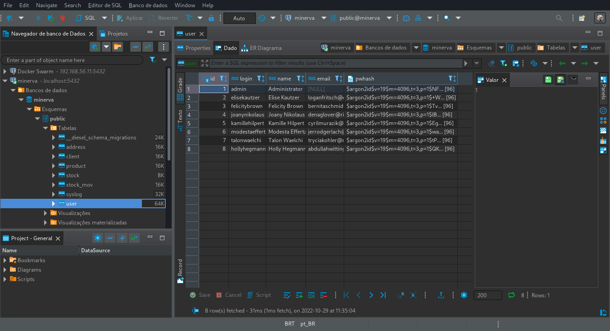

# Ferramentas para monitoramento externo

Esta seção demonstra algumas ferramentas que podem ser utilizadas para
monitoramento dos serviços cujo _deploy_ tenha sido realizado por meio de
Kubernetes.

A maioria dos serviços a seguir pode ser acessado através de _port-forward_.


## MongoDB Compass (para MongoDB)

<center>

</center>

O MongoDB Compass é uma ferramenta para desktop que permite inspecionar
documentos no MongoDB.

Para utilizá-lo, primeiramente realize _port-forward_ do MongoDB para
sua porta padrão na máquina atual:

```bash
kubectl port-forward -n minerva deployment/mongodb-deployment 27017:27017
```

Em seguida, conecte-se à instância do MongoDB através do host *`localhost:27017`*,
com usuários e senha padrão `root` e `mongo`.

<center>

</center>


## RESP.app (para Redis)

<center>

</center>

O RESP.app é uma ferramenta para desktop que permite inspecionar dados em cache
em um serviço Redis ou Redis Cluster.

Para acessar o Redis através dele, realize primeiro o _port-forward_ para
a porta padrão do Redis na sua máquina:

```bash
kubectl port-forward -n minerva statefulset/redis 6379:6379
```

Em seguida, clique em _Connect To Redis Server_. No campo de URL, digite o mesmo
texto do _hint_ apresentado (`redis://localhost:6379`), e então clique em _Import_.

Na próxima janela, dê um nome para a conexão e clique em OK. Não é necessário
segurança ou autenticação.

<center>

</center>


## DBeaver Community Edition (para PostgreSQL)

<center>

</center>

O DBeaver é um cliente universal para banco de dados que permite inspecionar tabelas,
schemas, e executar código SQL.

Para acessar o banco de dados PostgreSQL através dele, primeiramente exponha o banco
do cluster localmente através de _port-forward_ na porta padrão esperada:

```bash
kubectl port-forward -n minerva deployment/postgresql-deployment 5432:5432
```

Em seguida, abra o DBeaver e clique na opção para uma nova conexão, no menu
_Banco de dados_ (ou _Database_). Selecione a opção PostgreSQL, clique em _Next_,
e instale quaisquer drivers necessários que venham a ser pedidos.

<center>

</center>


Em seguida, você poderá manter o host e porta padrões (`localhost:5432`), mas
deverá alterar o campo _Database_ de acordo com o _tenant_ que você deseja acessar.

Além disso, por padrão, use usuário `postgres` e senha `postgres`.

<center>

</center>

Você poderá agora navegar nas abas à esquerda para localizar quaisquer tabalas que
desejar, e poderá também fazer outras operações com o banco.

<center>

</center>


## RabbitMQ

<center>

</center>

O serviço de mensageria RabbitMQ já provê um painel de monitoramento e configuração
em seu _deployment_. Esse painel não fica normalmente exposto pelo Minerva System,
mas pode ser acessado através de _port-forward_.

O RabbitMQ expõe três portas:

- `5672` (porta `amqp`, para conexões com filas);
- `15672` (porta `management`, para gerenciamento da aplicação);
- `15692` (porta `vhost`, para gerenciamento de hosts virtuais, em especial usado
  para _multi-tenant_).

Para acessar o painel do RabbitMQ, vamos expor localmente, através de _port-forward_,
a porta `management` (`15672`). Mas caso seja necessário realizar alguma operação
extra, você poderá expor as portas anteriores também.

```bash
kubectl port-forward -n minerva deployment/rabbitmq-deployment 15672:15672
```

Em seguida, acesse o painel do RabbitMQ pelo navegador, em `http://localhost:15672`.
Para realizar login, use o usuário padrão `rabbitmq` e a senha `minerva`.

<center>

</center>


## Grafana

<center>

</center>

A ferramenta Grafana é uma ferramenta de criação de dashboards para monitoramento.
O Minerva System provisiona o Grafana pelo Kubernetes, e o alimenta com dados
primariamente através do serviço Prometheus.

O Grafana não exige configuração extra para ser acessado, basta acessar o cluster
através de um navegador, na rota `/grafana`, já que existe um Ingress exclusivo
para este serviço. Ao realizar _login_, você poderá entrar na conta do administrador
através do usuário padrão `admin` e senha inicial `admin`; após o login, você
também poderá mudar a senha do `admin`, se quiser.

Ao acessar o Grafana, você será agraciado com uma tela inicial.

<center>

</center>

É possível, por fim, acessar alguns dashboards já provisionados através da
configuração padrão do Minerva System, ou instalar algum outro dashboard,
desde que este seja capaz de trabalhar com as métricas fornecidas por padrão.

<center>

</center>

Por padrão, o Prometheus fornece para o Grafana métricas de:

- Cluster (Kubernetes);
- RabbitMQ.

### Alguns dashboards úteis

Os dashboards a seguir são úteis para monitoramento do cluster Kubernetes
através dos dados obtidos pelo Prometheus através do scraping das várias
rotas de métricas do K8s, e podem ser importados diretamente pelo Grafana.

- [Kubernetes Cluster Monitoring (via Prometheus)](https://grafana.com/grafana/dashboards/315-kubernetes-cluster-monitoring-via-prometheus/)
- [Kubernetes apiserver](https://grafana.com/grafana/dashboards/12006-kubernetes-apiserver/)
- [1 K8S for Prometheus Dashboard 20211010 EN](https://grafana.com/grafana/dashboards/15661-1-k8s-for-prometheus-dashboard-20211010/)

