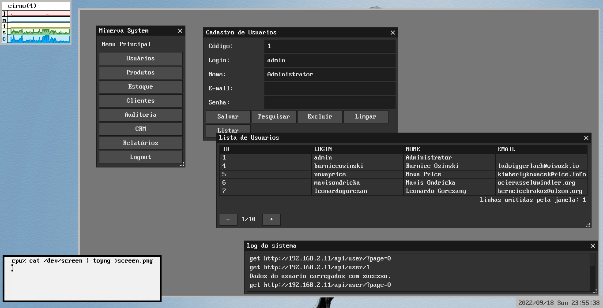

# Interface para Plan 9 from Bell Labs

O Minerva System possui uma interface gráfica projetada especificamente para o
sistema operacional [Plan 9 from Bell Labs](http://9p.io/plan9/) ou, mais
especificamente, para um *fork* moderno e robusto desse sistema operacional,
conhecido como [9front](https://9front.org/).

- [Link para o repositório](https://git.sr.ht/~luksamuk/minerva9)

## Apresentação

O front-end conhecido como Minerva9 é uma aplicação totalmente construída na linguagem
C, mais especificamente no dialeto de C suportado no Plan 9 (parcialmente C99-compliant),
que tenta levar em consideração as características desse sistema peculiar, especialmente
no que tange à forma como o sistema lida com o protocolo HTTP.

## Motivação

A existência dessa aplicação está relacionada principalmente ao fato de, sendo bem sincero,
eu (Lucas) ser um entusiasta, utilizador e estudioso assíduo desse sistema e de suas
tecnologias, que continuam atuais mesmo nos dias de hoje.

Este front-end possui algumas características especiais que evidenciam algumas
funcionalidades do Plan 9, o que inclui:

- Uso extensivo da biblioteca [`microui`](https://git.sr.ht/~ft/microui), uma biblioteca
  para construir aplicações gráficas no Plan 9, através da linguagem C;
- Uso extensivo de [`webfs(4)`](http://man.9front.org/4/webfs), como forma de realizar
  requisições REST à API do Minerva, e [`webcookies(4)`](http://man.9front.org/4/webcookies)
  para gerenciar cookies de sessão. Isso está em conformidade com a ideia de utilizar arquivos
  e sistemas de arquivos como recursos, em vez de importar novas bibliotecas, quando estas
  não são realmente necessárias (ou existentes);
- Desenvolvimento rápido de uma interface simples, similar à interface para terminal
  `minerva_tui` (também discutida nessa documentação), que não pode ser compilada no
  Plan 9, ainda que o sistema suporte a linguagem Go;
- Talvez uma prova-de-conceito para estudar a estrutura do sistema Plan 0, que possui algumas
  ideias interessantes, conceitos e utilitários que ainda podem ser utilizados em outros
  sistemas.

## Documentação

Não.

## Agradecimentos

Obrigado a `sigrid` por desenvolver a biblioteca `microui` de forma brilhante, e pelas
demais pessoas que mantém o 9front e provam que Plan 9 ainda é muito legal.

## Licenciamento

O Minerva9 é distribuído sob uma licença GPLv3, que pode ser consultada em seu repositório.

