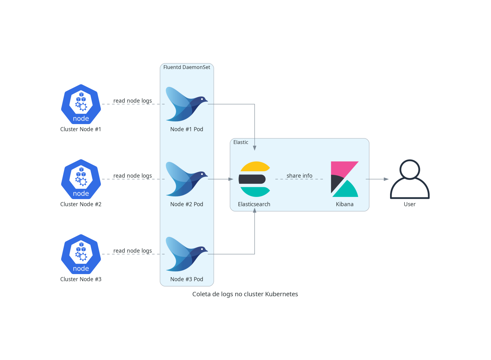

# Coleta de Logs

O Minerva System possui um sistema de coleta de logs especificamente no contexto de um
deploy para Kubernetes.

A coleta é feita para cada nó do Kubernetes, através de um DaemonSet, que criará um _pod_
em cada nó do cluster. Cada _pod_ terá acesso de leitura aos logs de todos os _pods_ em
execução no nó; periodicamente, cada _pod_ do Fluentd enviará um log stash para o serviço
do Elasticsearch. O usuário poderá então consultar logs, realizar queries e montar
dashboards através do Kibana.

O diagrama a seguir é uma representação simplificada de como a coleta de logs opera.

Também é possível utilizar o Grafana para realizar a criação de _dashboards_ com dados
do Elasticsearch, porém será necessário adicioná-lo como fonte de dados nas configurações
do Grafana, pois isso não é feito por padrão.

Para maiores informações, veja [como utilizar o ElasticSearch para verificar logs](./monitoramento-elasticsearch.md).
