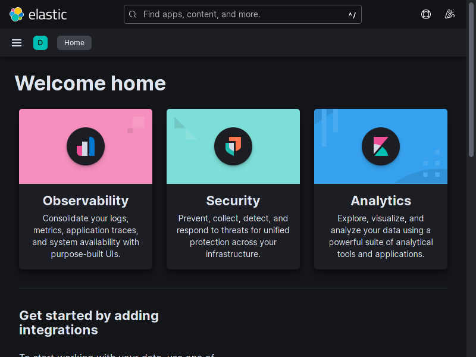
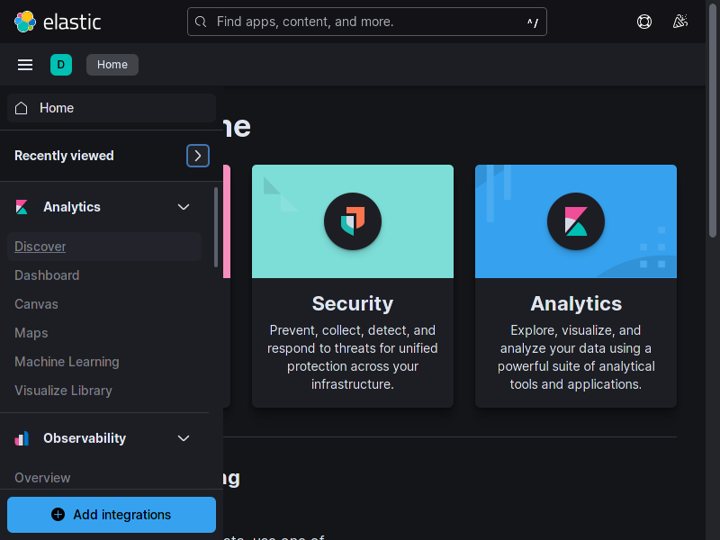
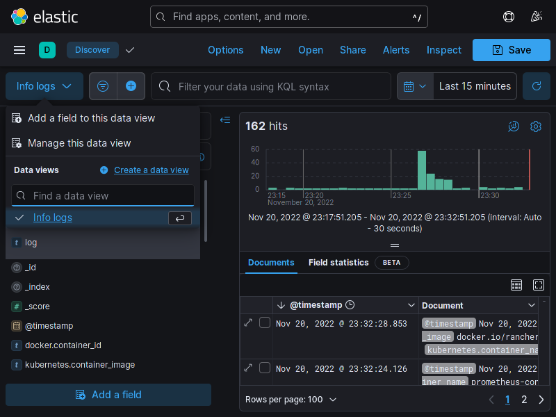
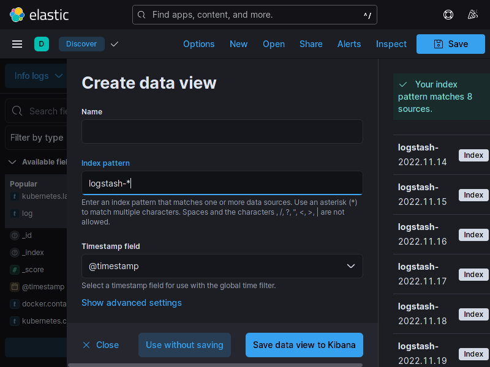
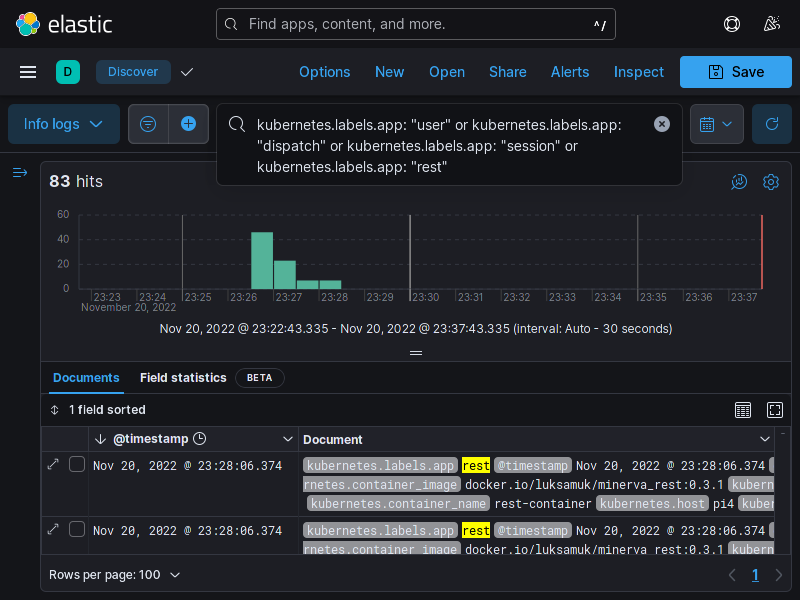
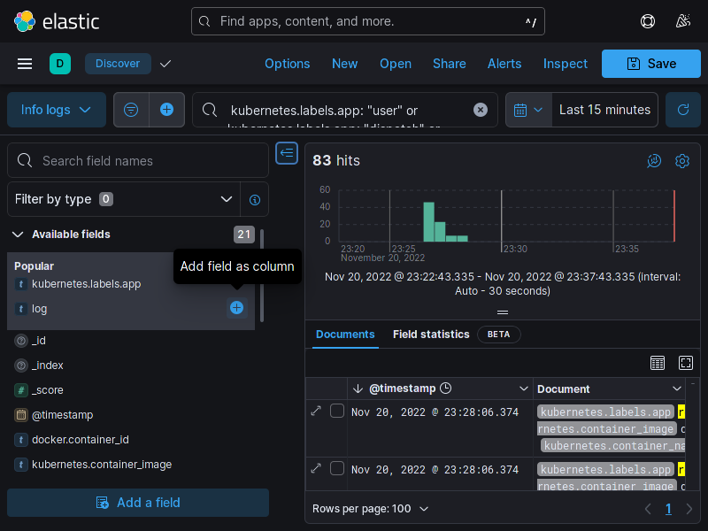
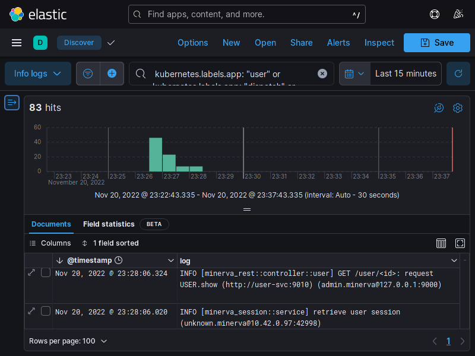

# ElasticSearch

A ferramenta ElasticSearch é uma ferramenta de busca e _analytics_ através de
documentos que podem se interrelacionar, como por exemplo, no caso de logs.
O Minerva System provisiona o ElasticSearch pelo Kubernetes para indexação e
armazenamento de logs. Tais dados são alimentados primariamente através do
serviço Fluentd, que realiza scraping dos logs de cada _pod_.

Para realizar _queries_ e analisar os dados armazenados no ElasticSearch,
o Minerva System também provisiona o Kibana, uma interface gráfica própria
que se integra com o ElasticSearch.

O Kibana não exige configuração extra e nem mesmo autenticação para ser acessado
(note que isso poderá mudar no futuro). Para tanto, você poderá utilizar o
Ingress exclusivo para o Kibana, que poderá ser acessado na rota `/kibana` do
cluster.

Ao acessar o Kibana, você verá a seguinte tela inicial.

Em seguida, no menu lateral, vá até a sessão _Analytics_ e selecione _Discover_.

Você verá a tela de gerenciamento e logs. Para adicionar os logs do cluster
(enviados ao ElasticSearch via Fluentd através de log stashes), clique no botão
de data views (canto superior esquerdo) e selecione a opção _Create a data view_,
como mostra a seguir.

Na janela que abre, dê o nome que quiser ao data view, e no campo Index pattern,
escreva `logstash-*`, para indicar que você deseja consumir dados de todos os
log stashes criados pelo Fluentd.

Após clicar em "Save data view to Kibana", você poderá realizar queries diretamente
no data view informado. A tela a seguir exemplifica uma query para exibir logs
dos microsserviços.

Você poderá também adicionar novos campos à tabela, selecionando campos possíveis
no menu de filtros que fica à esquerda.

