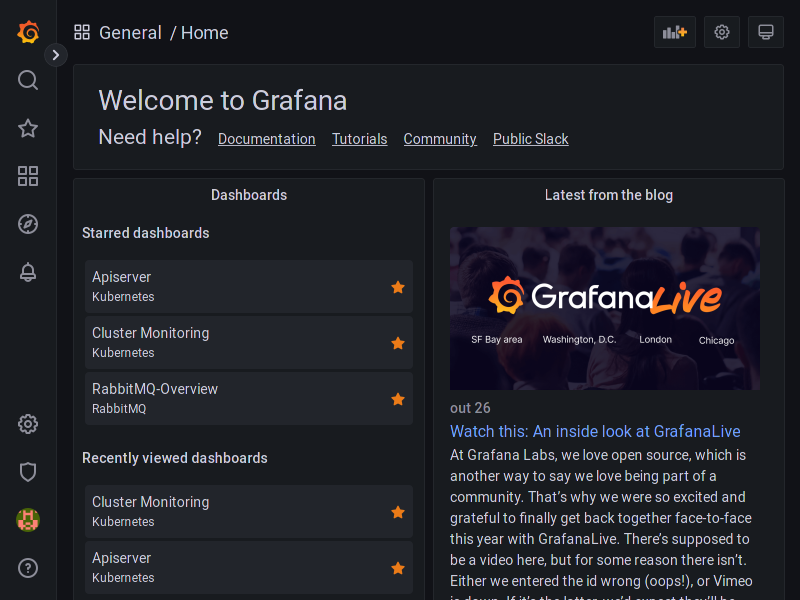
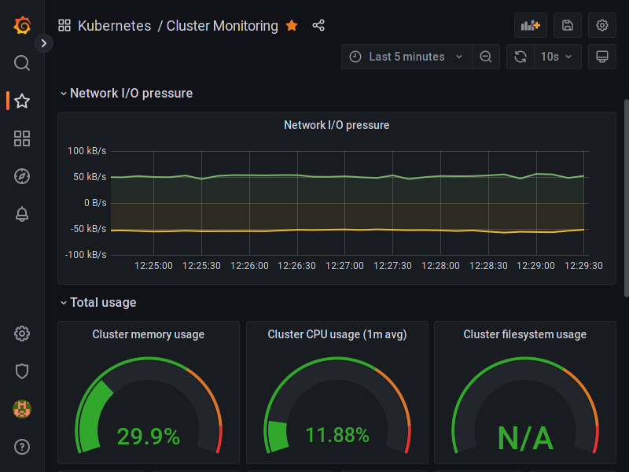

# Grafana

A ferramenta Grafana é uma ferramenta de criação de dashboards para monitoramento.
O Minerva System provisiona o Grafana pelo Kubernetes, e o alimenta com dados
primariamente através do serviço Prometheus.

O Grafana não exige configuração extra para ser acessado, basta acessar o cluster
através de um navegador, na rota `/grafana`, já que existe um Ingress exclusivo
para este serviço. Ao realizar _login_, você poderá entrar na conta do administrador
através do usuário padrão `admin` e senha inicial `admin`; após o login, você
também poderá mudar a senha do `admin`, se quiser.

Ao acessar o Grafana, você será agraciado com uma tela inicial.

É possível, por fim, acessar alguns dashboards já provisionados através da
configuração padrão do Minerva System, ou instalar algum outro dashboard,
desde que este seja capaz de trabalhar com as métricas fornecidas por padrão.

Por padrão, o Prometheus fornece para o Grafana métricas de:

- Cluster (Kubernetes);
- RabbitMQ.

### Alguns dashboards úteis

Os dashboards a seguir são úteis para monitoramento do cluster Kubernetes
através dos dados obtidos pelo Prometheus através do scraping das várias
rotas de métricas do K8s, e podem ser importados diretamente pelo Grafana.

- [Kubernetes Cluster Monitoring (via Prometheus)](https://grafana.com/grafana/dashboards/315-kubernetes-cluster-monitoring-via-prometheus/)
- [Kubernetes apiserver](https://grafana.com/grafana/dashboards/12006-kubernetes-apiserver/)
- [1 K8S for Prometheus Dashboard 20211010 EN](https://grafana.com/grafana/dashboards/15661-1-k8s-for-prometheus-dashboard-20211010/)

