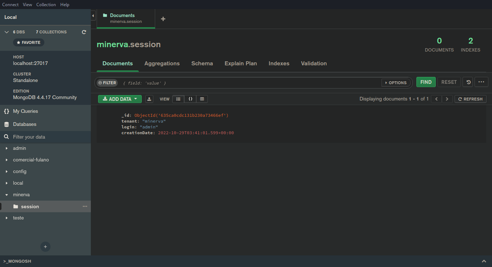

# MongoDB Compass (para MongoDB)

<center>

</center>

O MongoDB Compass é uma ferramenta para desktop que permite inspecionar
documentos no MongoDB.

Para utilizá-lo, primeiramente realize _port-forward_ do MongoDB para
sua porta padrão na máquina atual:

```bash
kubectl port-forward -n minerva deployment/mongodb-deployment 27017:27017
```

Em seguida, conecte-se à instância do MongoDB através do host *`localhost:27017`*,
com usuários e senha padrão `root` e `mongo`.

<center>

</center>

