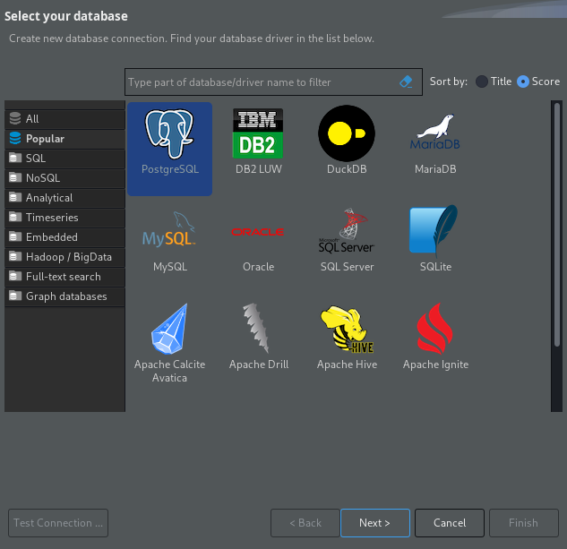
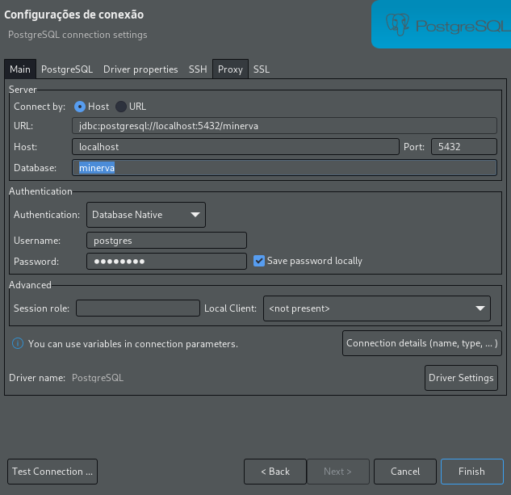
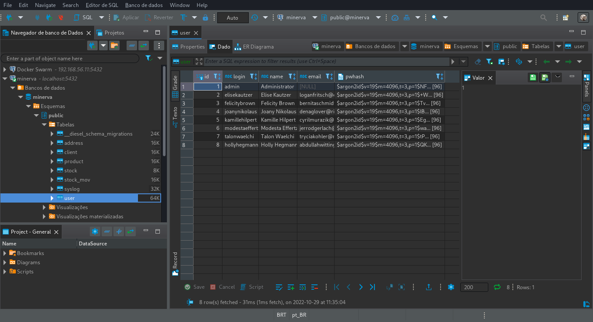

# DBeaver Community Edition (para PostgreSQL)

<center>

</center>

O DBeaver é um cliente universal para banco de dados que permite inspecionar tabelas,
schemas, e executar código SQL.

Para acessar o banco de dados PostgreSQL através dele, primeiramente exponha o banco
do cluster localmente através de _port-forward_ na porta padrão esperada:

```bash
kubectl port-forward -n minerva deployment/postgresql-deployment 5432:5432
```

Em seguida, abra o DBeaver e clique na opção para uma nova conexão, no menu
_Banco de dados_ (ou _Database_). Selecione a opção PostgreSQL, clique em _Next_,
e instale quaisquer drivers necessários que venham a ser pedidos.

<center>

</center>


Em seguida, você poderá manter o host e porta padrões (`localhost:5432`), mas
deverá alterar o campo _Database_ de acordo com o _tenant_ que você deseja acessar.

Além disso, por padrão, use usuário `postgres` e senha `postgres`.

<center>

</center>

Você poderá agora navegar nas abas à esquerda para localizar quaisquer tabalas que
desejar, e poderá também fazer outras operações com o banco.

<center>

</center>

