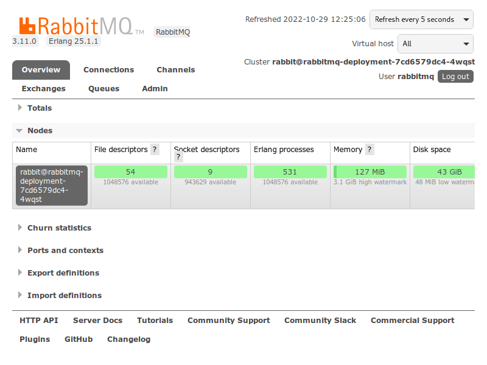

# RabbitMQ

<center>

</center>

O serviço de mensageria RabbitMQ já provê um painel de monitoramento e configuração
em seu _deployment_. Esse painel não fica normalmente exposto pelo Minerva System,
mas pode ser acessado através de _port-forward_.

O RabbitMQ expõe três portas:

- `5672` (porta `amqp`, para conexões com filas);
- `15672` (porta `management`, para gerenciamento da aplicação);
- `15692` (porta `vhost`, para gerenciamento de hosts virtuais, em especial usado
  para _multi-tenant_).

Para acessar o painel do RabbitMQ, vamos expor localmente, através de _port-forward_,
a porta `management` (`15672`). Mas caso seja necessário realizar alguma operação
extra, você poderá expor as portas anteriores também.

```bash
kubectl port-forward -n minerva deployment/rabbitmq-deployment 15672:15672
```

Em seguida, acesse o painel do RabbitMQ pelo navegador, em `http://localhost:15672`.
Para realizar login, use o usuário padrão `rabbitmq` e a senha `minerva`.

<center>

</center>

