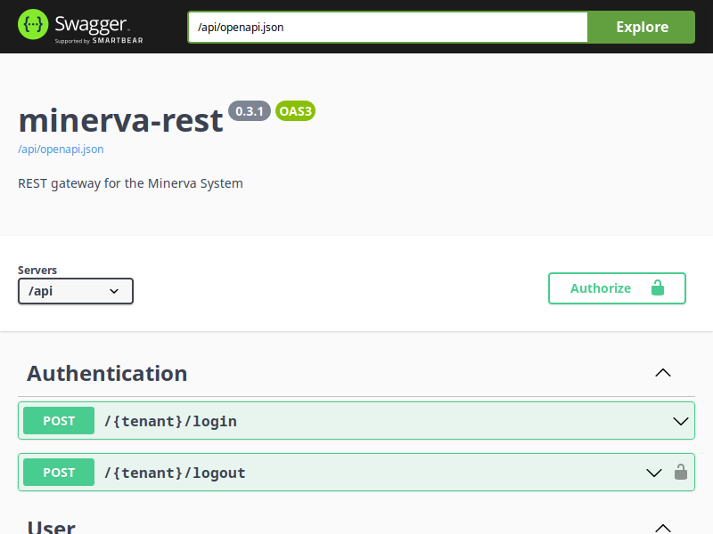
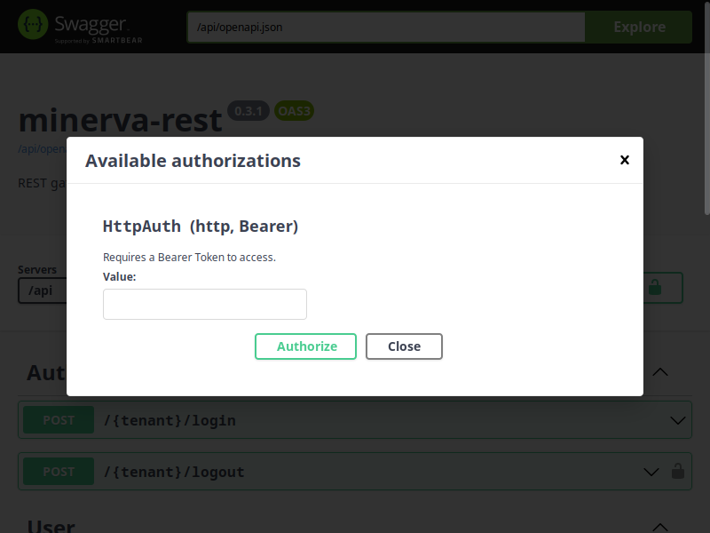
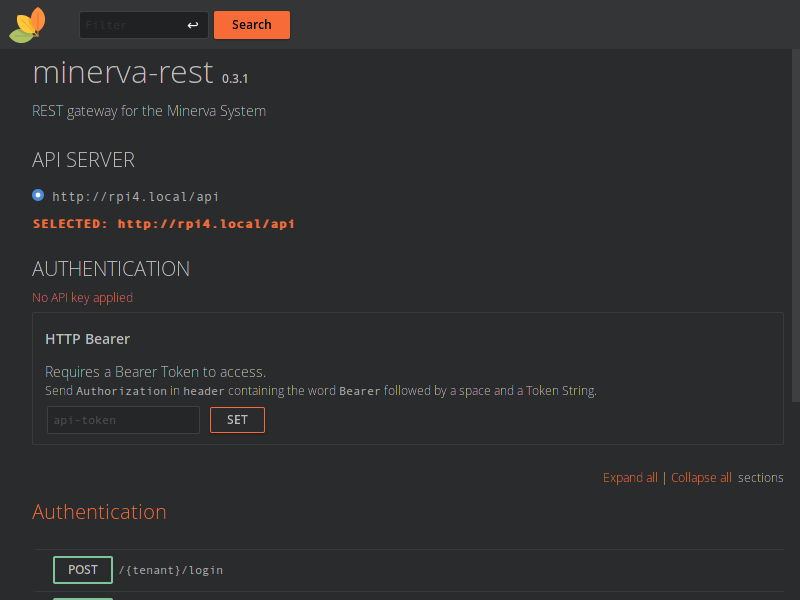

# Swagger e RapiDoc

A API do Minerva System possui uma especificação compliant com OpenAPI 3, sendo portanto
testável a partir de vários serviços. A especificação OAS do Minerva System é sempre
exportada através do arquivo `openapi.json`, pela própria API (acessível na raiz do
_subpath_ no qual a mesma é provisionada; no caso do k8s, como a API opera em `/api`,
esse arquivo pode ser encontrado em `/api/openapi.json`).

Como forma padrão para testar requisições, a API do Minerva System provisiona também
duas interfaces: **Swagger** e **RapiDoc**. Ambas são construídas pela API em si e
não são criadas de forma externa à mesma. Além disso, ambas estarão acessíveis mesmo
ao executar o Gateway da aplicação (microsserviço `minerva-rest`) localmente.

## Usando o Swagger

O Swagger é a interface gráfica mais utilizada atualmente para testar uma API pública.
Para acessá-la, abra seu navegador de internet e acesse a página pela rota `/api/swagger`.

Após utilizar a requisição de login, você poderá clicar no botão _Authorize_ e, na tela a
seguir, colar o token de autenticação.

Após clicar no botão _Authorize_ da tela acima, requisições subsequentes serão realizadas
com um Bearer Token incluído no cabeçalho das mesmas.

## Usando o RapiDoc

O RapiDoc é uma interface alternativa ao Swagger, sendo mais compacta e com algumas
funcionalidades diferentes. Para acessá-la, abra seu navegador de internet e acesse a
página pela rota `/api/rapidoc`.

De forma similar ao Swagger, após utilizar a requisição de login, você poderá colar
o token de autenticação na caixa de texto `api-token` da seção _AUTHENTICATION_, e clicar
no botão _SET_. Requisições subsequentes serão realizadas com um Bearer Token incluído
no cabeçalho das mesmas.
